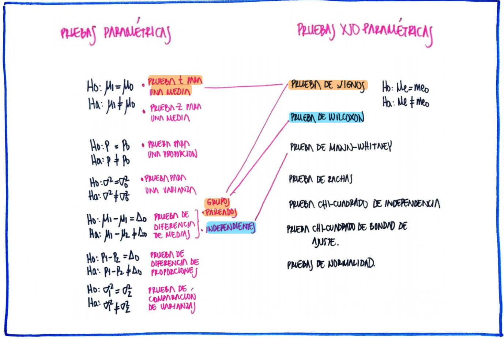

```{r setup, include=FALSE}
knitr::opts_chunk$set(echo = TRUE, comment = NA)

c1 ="#FF7F00"  # naranja - color primario 
c2 ="#034A94"  # azul oscuro - color secundario
c3 ="#0EB0C6"  # azul claro - color terciario
c4 ="#686868"  # gris - color texto
```


```{r, echo=FALSE, out.width="100%", fig.align = "center"}
knitr::include_graphics("img/banner_guia.png")
```

<br/><br/>

# **Guía de aprendizaje**


## **Introducción**

El origen de los estudios, relacionados con las pruebas de hipótesis estadísticas, se sitúa alrededor de 1738, cuando en un ensayo escrito por Daniel Bernoulli aparece el cálculo una estadística de prueba para ensayar su hipótesis en el campo de la astronomía. Entre 1915 y 1933 se desarrolla esta formulación gracias a los estudios realizados por tres grandes autores: Ronald Fisher, Jerzy Neyman y Egon Pearson. Hoy en día predomina la teoría de Neyman-Pearson (lema de Neyman-Pearson). 

Una hipótesis estadística es una afirmación o conjetura acerca de los parámetros de la distribución de probabilidades de una población. Si la hipótesis estadística especifica completamente la distribución, entonces ella se llama Hipótesis Simple, de otra manera se llama Hipótesis Compuesta.

Las pruebas de hipótesis constituyen una de las principales herramientas que  proporciona la estadística a un profesional de cualquier disciplina para darle un carácter científico a sus afirmaciones y decisiones.

En esta unidad se plantea el siguiente objetivo, el cual podrá lograrse con el desarrollo de los trabajos planteados y documentación proporcionada.


<br/><br/>

## **Objetivos de la unidad**

Al finalizar la unidad el estudiante estará en capacidad de IDENTIFICAR, CALCULAR, CONTRASTAR y CONCLUIR sobre una hipótesis estadística no paramétricas  que le permita la  tomar decisiones informadas.

<br/><br/>

## **Duración**

La presente  unidad será desarrollada durante la comprendida entre 19 de marzo y el 2 de abril  de 2024.   
Ademas del material suministrado  contaran con el acompañamiento del profesor y de manera asincrónica con  foro de actividades académicas. Los entegables para esta unidad podrán enviarse a través de la plataforma Brightspace hasta el  2 de abril.

Para alcanzar los objetivos planteados se propone realizar las siguientes actividades


<br/><br/>

## **Cronograma de trabajo**

<br/><br/>


|Actividad         | Descripción                    | 
|:-----------------|:-----------------------------  |
|**Actividad 331** | Resuelva las preguntas y problemas planteadas en el **Taller 331** y entregue su solución  en formato  pdf en el enlace correspondiente de  Brightspace   |
|Trabajo individual|                                |
|Fecha             | abril 2  de 2024               |
|Hora              | 23:59 hora local               |
|                  |                                |
<br/><br/>

## **Criterios de evaluación**


+ Reconoce los diferentes conceptos asociados con las pruebas de hipótesis no paramétricas 
+ Comunica de manera adecuada los resultados obtenidos del procesamiento 
+ Genera recomendaciones y decisiones a partir de los resultados obtenidos

<br/><br/>

## **Entregables** 

|               |                              | 
|:--------------|:-----------------------------|
| Actividad 431 | Solucionario taller 431 de problemas sobre pruebas de hipótesis no paramétricas| | Fecha         | 2 de abril de 2024           |
| Hora          | 23:59 hora local             |
|               |                              |

<br/><br/>


<br/><br/>

### **Recursos**: 

### **Video no paramétricas**

<center>
<iframe width="560" height="315" src="https://www.youtube.com/embed/m3YIdS2TVHk" title="YouTube video player" frameborder="0" allow="accelerometer; autoplay; clipboard-write; encrypted-media; gyroscope; picture-in-picture" allowfullscreen></iframe>

</center>


<br/><br/>


<br/><br/>
```{r, echo=FALSE, out.width="100%", fig.align = "center"}

```


