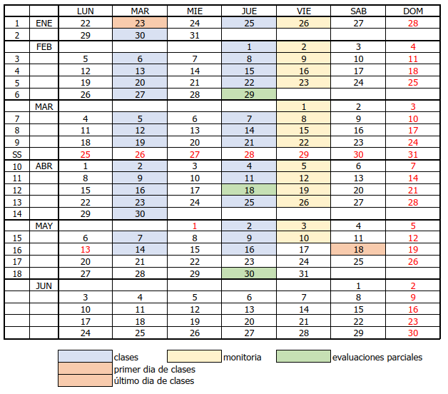

```{r setup, include=FALSE}
knitr::opts_chunk$set(echo = TRUE, comment = NA)

c1 ="#FF7F00"  # naranja - color primario 
c2 ="#034A94"  # azul oscuro - color secundario
c3 ="#0EB0C6"  # azul claro - color terciario
c4 ="#686868"  # gris - color texto
```

<br/><br/>


# **Información básica**

* Código : 30MAE014
* Departamento que la ofrece : Ciencias Naturales y  Matemáticas
* Área de conocimiento. Estadística -Matemáticas y Ciencias Naturales  
* Nucleo básico de conocimiento : Estadística
* Créditos : 3
* Número total de horas : 144
* Horas de clase semanales : 4
* Horas de trabajo independiente : 5 (2 con monitor, 3 de trabajo independiente)

* Prerrequisitos : Teoría de Probabilidad (300MAE013)
* Correquisitos : ninguno
* Asignaturas equivalentes : ninguna
* Modalidad : Presencial
* Idioma en que se imparte : Español
* Profesor : Daniel Enrique González Gómez - dgonzalez@javerianacali.edu.co
* Monitor :

<br/><br/>

## **Descripción**

En el curso se abordan el muestreo y las bases de para que el estudiante aplique la inferencia estadística usando estimación puntual, intervalo de confianza y prueba de hipótesis como también la estimación de valores de una variable de respuesta y de valores futuros con el modelo de regresión lineal simple y el análisis de varianza para la comparación de media en un diseño de experimentos.  

Se fortalecerán competencias en resolución de problemas, en comunicación y computacionales que permitan fundamentar las bases y el pensamiento estadístico para aplicar los métodos inferenciales en diversos contextos.  Se adoptan metodologías de aprendizaje y evaluación acordes con la metodología estadística, la definición de hipótesis, postulación de modelos y el diseño de experimentos, como el estudio de casos, la simulación, el uso de software  y el desarrollo de proyectos temáticos a lo largo del curso. 

<br/><br/>

## **Objetivos**    

* Identificar el problema en una situación de interés. 
* Identificar los conceptos, métodos de estimación y técnicas estadísticas de procesamiento de datos, necesarios para la solución de un problema identificado.  
* Resolver problemas que involucran estimación de parámetros, prueba de test de hipótesis, análisis de regresión lineal o comparación de medias en un diseño de experimentos, aplicando metodologías estadísticas y software para el procesamiento de datos. 
* Analizar e interpretar la información disponible en distintas fuentes: tablas, gráficos, bases de datos, resultados de procesamiento, modelos   o publicaciones de carácter inferencial. 
* Comunicar los resultados obtenidos de un estudio inferencial.  

<br/><br/>

## **Contenidos** 

<br/>

### **Módulo 1: Muestreo y Estimación Puntual** 
(2 semanas) 

* Introducción al muestreo. Tipos de muestreo. 
* Estimador puntual. Propiedades: insesgadez, consistencia y eficiencia relativa. 
* Método de momentos y de máxima verosimilitud 

* Valor esperado y varianza de la media muestral y de la proporción muestral. 
* Distribución de probabilidad de la media muestral y de la proporción muestral: Teorema del límite central. 
* Distribución de probabilidad de la diferencia de medias muestral y de la diferencia de proporciones muestrales. 

<br/><br/>

### **Módulo 2: Estimación por intervalo de confianza**  
(4 semanas) 

* Límites de confianza, nivel de confianza, error de estimación. 
* Intervalo de confianza para la estimación de la media. 

* Límites de predicción y de tolerancia. 

* Intervalo de confianza para la estimación de la proporción y varianza en una población. 

* Tamaño de muestra para la estimar la media y la proporción por intervalo de confianza. 

* Comparación de dos poblaciones a partir de sus medias, proporciones y varianzas usando intervalos de confianza. 

 <br/><br/>

### **Módulo 3: Hipótesis Estadística**  
(5 semanas) 

* Introducción a la prueba de hipótesis: Hipótesis nula y alternativa, nivel de significancia, errores tipo I y tipo II, potencia. 

* Prueba de hipótesis para el parámetro de una población: media, proporción y varianza. Valor p en la toma de decisiones. 

* Prueba de hipótesis de dos poblaciones. 

* Prueba Chi cuadrado para homogeneidad y pruebas de bondad de ajuste  
* Pruebas no paramétricas 

<br/><br/>

### **Módulo 4: Regresión Lineal**  
(2 semanas) 

* Introducción a la regresión lineal, análisis de correlación lineal.  Supuestos en la regresión. 
* Modelo de regresión lineal simple: Estimación por mínimos cuadrados, análisis de varianza, validación de supuestos,  

* Introducción al Modelo de Regresión Lineal múltiple: Modelo, criterios de selección del modelo. Supuestos 

<br/><br/>

### **Módulo 5: Diseño de Experimentos**  
(3 semanas) 

* Introducción al diseño de experimentos: Factor, nivel, tratamiento, repetición. 

* Modelo de ANOVA para uno y dos factores 
* Comparaciones múltiples 


<br/><br/>

## **Estrategias pedagógicas** 

El fortalecimiento de las competencias se logrará mediante lecturas y ejercicios previos a la clase, presentación, por parte del profesor, de conceptos, técnicas y métodos, apoyado en medios audiovisuales, tablero y computador.  Talleres de refuerzo para trabajar fuera de clase. Asesoría de distintos profesores en horarios de atención planeados en el departamento que brinda el curso. Talleres temáticos que los estudiantes resuelven con el acompañamiento semanal de un monitor.  Laboratorios de cómputo y proyectos de aplicación temática donde los estudiantes en grupo identifican una situación crítica a partir de la cual presentan un proyecto en cuyo desarrollo analizan y resuelven problemas sencillos con la aplicación de métodos y software estadístico. 

<br/><br/>

## **Evaluación** 

|Actividades porcentajes | Número de actividades | porcentaje por actividad | Porcentaje Total por actividad | 
|:-----------------------|:---------------------:|:------------------------:|:------------------------------:|
| Exámenes               | 3                     |  20                      | 60                             |
| Quices                 | 3                     |   5                      | 15                             | 
| Laboratorio            | 3                     |   5                      | 15                             | 
| Proyecto               | 1                     |  10                      | 10                             | 

 

<br/><br/>

## **Referencias** 

* Alvarado, J. Obagui, J. Fundamentos de Inferencia Estadística 1ª Ed. Editorial Javeriana, 2008 
* DeGroot Morris. Probabilidad y Estadística, Addison Wesley 1986 
* Hernández H, Guijarro Martha, Rojo José L., Sans José A. Cálculo de probabilidades y estadística, Ariel Economía. 1994 
* Mendenhall, W. & Sincich, T. Probabilidad y estadística para ingeniería y ciencias. Prentice Hall. 1997 
* Navidi, W. Statistics for Engineers and Scientists.  Mc Graw Hill. 2016. 
* Romero, R. y Zúnica, L. Métodos Estadísticos en Ingeniería. Limusa, 2008 
* Walpole, R. Myers, R. Myers, S. Ye, K. Probabilidad y Estadística para ingeniería y Ciencias. 9 Ed. Editorial Pearson. 2012 
 
 
 
# **Cronograma**


```{r, echo=FALSE, out.width="100%", fig.align = "center"}

```

