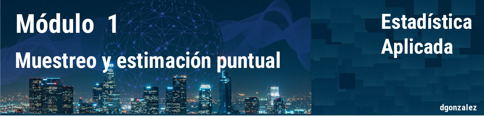

---
output:
  html_document:
    toc: no
    toc_depth: 2
    toc_float: yes
    code_folding: hide
    theme:  flatly
---

```{r setup, include=FALSE}
knitr::opts_chunk$set(echo = TRUE, message = FALSE, warning = FALSE, comment = NA)


# install.packages("devtools")
# devtools::install_github("dgonxalex80/paquete014")
#library(paquete014)


```


```{r, echo=FALSE, out.width="100%", fig.align = "center"}

```

<br/><br/>

* Introducción al muestreo. Tipos de muestreo.

* Estimador puntual. Propiedades: insesgadez, consistencia y eficiencia relativa.

* Método de momentos y de máxima verosimilitud

* Valor esperado y varianza de la media muestral y de la proporción muestral.

* Distribución de probabilidad de la media muestral y de la proporción muestral: Teorema del límite central.

* Distribución de probabilidad de la diferencia de medias muestral y de la diferencia de proporciones muestrales.

<br/><br/>


