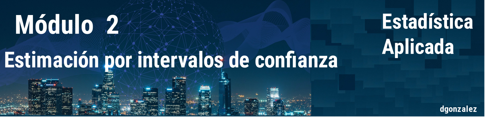

---
output:
  html_document:
    toc: no
    toc_depth: 2
    toc_float: yes
    code_folding: hide
    theme:  flatly
---

```{r setup, include=FALSE}
knitr::opts_chunk$set(echo = TRUE, message = FALSE, warning = FALSE, comment = NA)


# install.packages("devtools")
# devtools::install_github("dgonxalex80/paquete014")
#library(paquete014)


```


```{r, echo=FALSE, out.width="100%", fig.align = "center"}

```

<br/><br/>

# **Estimación por intervalo de confianza**


* Límites de confianza, nivel de confianza, error de estimación.

* Intervalo de confianza para la estimación de la media.

* Límites de predicción y de tolerancia.

* Intervalo de confianza para la estimación de la proporción y varianza en una población.

* Tamaño de muestra para la estimar la media y la proporción por intervalo de confianza.

* Comparación de dos poblaciones a partir de sus medias, proporciones y varianzas usando intervalos de confianza.


<br/><br/>

