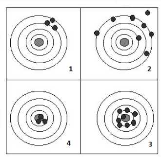

```{r setup, include=FALSE}
knitr::opts_chunk$set(echo = TRUE, message = FALSE, warning = FALSE, comment = NA)
library(psych)
library(summarytools)

# install.packages("devtools")
#devtools::install_github("dgonxalex80/paqueteDEG")
#library(paqueteDEG)

# colores
c0= "#F7AA00"
c1= "#235784"
c2= "#40A8C4"
c3= "#EEF6F7"

c4= "#11224D"
c5= "#5B84C4"


```


# **MÉTODOS DE ESTIMACIÓN**

<br/>
 
Para construir los estimadores se emplean métodos de estimacién como se describe a continuación:

<br/><br/>

## **MÉTODO DE MOMENTOS**

<br/>

El método de momentos fué propuesto por Karl Pearson al rededor de 1895, pensado en sus inicios en contexto descriptivo, analizando las distribuciones de probabilidad y aproximandolas al sistema de curvas que llevan su nombre.  Porteriormente este concepto fue modificado por R.A. Fisher en 1920. El método consiste en estimar un parámetro de una distribución igualando sus momentos teóricos o poblacionales, si existen, con los correspondientes momentos muestrales.\\

Para mostrar este método es necesario definir el concepto de momento.

<br/><br/>

### **Momento Poblacional k-esimo:**

<br/>

#### Caso variable discreta  

$M_{k}=E\big[X^{k}\big]=\sum_{Rx} x^{k}p(x)$

#### Caso variable continua

$M_{k}=E\big[X^{k}\big]=\int_{-\infty}^{\infty}x^{k}f(x) dx $ 


<br/><br/>

### **Momentos muestrales:**

<br/>

En ambos casos (v.a. discreta o continua)

$m_{k}=\frac{1}{n}\sum_{i=1}^{n} x_{i}^{k} $

El método de momentos supone que los momentos tanto poblacionales como muestrales son conocidos, y por lo tanto tambien la función de probabilidad. 
A continuación se relacionan algunos de estos momentos poblacionales:\\


<br/>

| Distribución |  $E[X]=\mu$ |  $V[X]=E[X^{2}]-E[X]^{2}=\sigma^{2}$ |
|:-------------|:------------|:-------------------------------------|
|Bernoulli     | $p$         | $pq$                                 |
|Geométrica    | $\displaystyle\frac{1}{p}$ | $\displaystyle\frac{q}{p^{2}}$|
|Binomial      | $np$        | $npq$                                |
|Poisson       | $\lambda$   | $\lambda$                            |
|Gamma         | $\alpha\beta$| $\alpha\beta^{2}$                   |
|Exponencial   | $\beta$     | $\beta^{2}$                          |
|Uniforme      |$\displaystyle\frac{a+b}{2}$ | $\displaystyle\frac{(b-a)^{2}}{12}$ |
|Normal        |$\mu$        |$\sigma^{2}$                          |

<br/><br/>

### **EJEMPLO** 

<br/>

Encuentre los estimadores de los parametros de la distribucion normal a traves del metodo de momentos.
Previamente sabemos que los parametros de una variable con distribucion normal son $E[X]=\mu$ y $V[X]=\sigma^{2}$ y que $V[X]=E[X^{2}]-E[X]^{2}$. Dada esta informacion el estimador de momentos se construye de la siguiente manera: 

$$M_{1}=m_{1} $$
$$M_{2}=m_{2} $$

<br/>

Aplicando el método:


$M_{1}=E[X]  = m_{1}$

$\mu = \displaystyle\frac{1}{n}\sum_{i=1}^{n}x_{i}$\


Finalmente,

$\widehat{\mu}  = \displaystyle\frac{1}{n}\sum_{i=1}^{n} x_{i}=\bar{x}$


Para estimar $\sigma^{2}$, se realiza el siguiente procedimiento usando $M^{1}=m^{1}$  y $M^{2}=m^{2}$.

$$V[X]=E[X^{2}]-E[X]^{2} = M_{2}-(M_{1})^{2}$$

entonces igualamos estos dos momentos poblacionales con sus respectivos momentos muestrales quedando la igualdad

$$V[X]= M_{2}-(M_{1})^{2}=\displaystyle\frac{1}{n}\sum_{i=1}^{n}x_{i}^{2}-\bar{x}^{2}$$
podemos representar la varianza por $\sigma^{2}$ y obtenemos

$$\sigma^{2}=\displaystyle\frac{1}{n}\sum_{i=1}^{n}x_{i}^{2}-\bar{x}^{2}$$

y obtenemos el estimador de la varianza:


$\widehat{\sigma^{2}}  =\displaystyle\frac{1}{n}\sum_{i=1}^{n}x_{i}^{2}-\bar{x}^{2}$

$\widehat{\sigma^{2}} = \displaystyle\frac{1}{n}\sum_{i=1}^{n}x_{i}^{2}-\bar{x}^{2}-\bar{x}^{2}+\bar{x}^{2}$

$= \displaystyle\frac{1}{n}\sum_{i=1}^{n}x_{i}^{2}-2\bar{x}^{2}+\bar{x}^{2}$

$= \displaystyle\frac{1}{n}\sum_{i=1}^{n}x_{i}^{2}-\displaystyle\frac{2\bar{x}\sum x_{i}}{n}+\displaystyle\frac{n \bar{x}^{2}}{n}$

$=\displaystyle\frac{1}{n}\Big(\sum_{i=1}^{n} x_{i}^{2}-2\bar{x}\sum_{i=1}^{n} x_{i}+\bar{x}^{2}\Big)$

$\widehat{\sigma^{2}} = \displaystyle\frac{1}{n}\sum_{i=1}^{n}\Big(x-\bar{x}\Big)^{2}$\\

<br/><br/>

En resumen los estimadores de momentos para los parámetros de la distribución normal son:

$$\widehat{\mu} = \displaystyle\frac{1}{n}\sum_{i=1}^{n} x_{i}=\bar{x} $$ 
$$\widehat{\sigma^{2}}=\displaystyle\frac{1}{n}\sum_{i=1}^{n}\Big(x-\bar{x}\Big)^{2}$$

A partir de ellos y mediante la obtención de una muestra aleatoria por ejemplo :630, 650, 710, 750, 790, 820, 860 y 910 se pueden estimar los parámetros por método de momentos con los siguientes resultados:

$$\widehat{\mu}=765$$  
$$\widehat{\sigma^{2}}=8550$$

<br/><br/><br/>

## **MÉTODO DE MÁXIMA VEROSIMILITUD**

<br/>

Uno de los mejores métodos para obtener un estimador puntual de un parámetro es el método de máxima verosimilitud o de máxima probabilidad. ESta tecnica fue desarrollada en 1920 por el estadístico britanico Sir R.A. Fosher. El estimador será el valor del parámetro que maximice la función de verosimilitud $L(\theta)$.  

La función de verosimilitud $L(\theta)$ corresponde a la funcion de distribución conjunta de variables aleatorias independientes con igual funcion de distribucion. Estas variables aleatorias corresponden a las variables que conforman la muestra.


$$L(\theta)=f(x_{1},\theta).f(x_{2},\theta).f(x_{3},\theta)....f(x_{n}),\theta)$$

El objetivo del método sera encotrar el valor del parametro que maximice la probabilidad conjunta.

El método supone el conocimiento de la función de distribución de probabilidad de la variable en estudio. Por 

<br/><br/><br/>

### **EJEMPLO**

En la unidad anterior tratamos en caso de la distribución normal cuya función de distribución de probabilidad esta dada por :

$$f(x_{i})=\frac{1}{\sqrt{2\pi}\sigma^{2}} \exp{\Bigg(-\frac{1}{2\sigma^{2}}\big(x_{i}-\mu\big)^{2}\Bigg)}$$

La función de verosimulitud estará dada por:

$$L(x_{1},x_{2},..,x_{n};\mu,\sigma^{2})=f(x_{1};\mu,\sigma^{2})....f(x_{n};\mu,\sigma^{2})$$
Esta función se puede escribir como :

$$L(x_{1},x_{2},..,x_{n};\mu,\sigma^{2})=\displaystyle\prod_{i=1}^{n} \frac{1}{\sqrt{2\pi \sigma^{2}}} \exp{\Bigg(-\frac{1}{2\sigma^{2}}\big(x_{i}-\mu\big)^{2}\Bigg)} $$

$$L=\displaystyle\Big(\frac{1}{2\pi \sigma^{2}}\Big)^{n/2} \exp \Bigg(\sum_{i=1}^{n}\frac{-1}{2\sigma^{2}}(x_{i}-\mu)^{2}\Bigg) $$

$$L=\displaystyle\Big(2\pi \sigma^{2}\Big)^{-n/2} \exp \Bigg(\frac{-1}{2\sigma^{2}}\sum_{i=1}^{n}(x_{i}-\mu)^{2}\Bigg) $$

El método consiste en encontrar el valor del parámetro que maximice esta función para lo cual procedemos a derivar $L$ parcialmente con respecto a $\mu$.

Este proceso presenta algunas dificultades de calculo que son atenuadas mediante la premisa de que el maximo de la funcion $L$ corresponde a los mismos maximos de la funcion $\ln(L)$, la cual es mas sencilla de derivar. Este procedimiento es posible debido a que la función $L$ es creciente

Convertimos $L$ en $ln(L)$
%
$$\ln(L)= -\displaystyle\frac{n}{2} \ln(2\pi) - \displaystyle\frac{n}{2} \ln(\sigma^{2})+\displaystyle\frac{1}{2\sigma^{2}}\displaystyle\sum_{i=1}^{n}(x_{i}-\mu)^{2}$$
Al derivar parcialmente $\ln(L)$ con respecto a $\mu$ tenemos:

$$\displaystyle\frac{\partial \ln(L)}{\partial \mu}= -\displaystyle\frac{{2}}{{2}\sigma^{2}}  \displaystyle\sum_{i=1}^{n} (x_{i}-\mu) =0$$

De esta igualdad se despeja el parámetro de interés
$${\sigma^{2}}\frac{1}{{\sigma^{2}}}\sum_{i=1}^{n} (x_{i}-\mu) =0 \sigma^{2} $$
$$\sum_{i=1}^{n} x_{i} - n \mu =0$$

$$\widehat{\mu}=\frac{1}{n}\sum_{i=1}^{n} x_{i} = \bar{x}$$

En el caso de la estimación de $\sigma^{2}$, se deriva $\ln(L)$ parcialmente con respecto a $\sigma^{2}$, se iguala a cero el resultado obtenido y por último se despeja $\sigma^{2}$. Verifique que el estimador de máxima verosimilitud para la varianza es igual a:

$$\widehat{\sigma^{2}}=\frac{1}{n-1}\sum_{i=1}^{n} \big(x_{i}-\mu \big)^{2} $$

<br/><br/><br/>

### **NOTA**

Algunas propiedades de la función $\ln(x)$ 

*  $\ln(xy) = \ln(x) + \ln(y)$
*  $\ln(x/y) = \ln(x) - \ln(y)$
*  $\ln(x^{n})=n \ln(x)$
*  $\ln(e^{x}) = x$


<br/><br/><br/>

# **PROPIEDADES DESEABLES EN LOS ESTIMADORES**

Anteriormente se describieron dos los metodos para la construcción de estimadores, Estos métodos generan diversas alternativas dentro de los cuales debemos seleccionar los mejores. Para realizar dicha clasificación debemos examinar sus primcipales propiedades como son la INSESGADEZ, CONSISTENCIA, EFICICIENCIA y SUFICIENCIA, entre otras.


```{r, echo=FALSE, out.width="100%", fig.align = "center"}

```

Un indicador que mide la calidad de un estimador $\widehat{\theta}$ se denomina Error Cuadrático Medio (ECM) y se define de la siguiente manera:

<br/><br/>

### **Def1**:  

Se define como **Error Cuadrático Medio** (ECM) el valor esperado de la diferencia entre el estimador y el parámetro, al cuadrado.

$$ECM[\widehat{\theta}]=E[\widehat{\theta}-\theta]^{2} $$

<br/><br/>

### **Insesgadez**

### **Def.2**: 

Se dice que el estimador $\widehat{\theta}$ que es función de los datos contenidos en una muestra, es un estimador insesgado del parametro $\theta$, si $E[\widehat{\theta}]=\theta$, para todos los posibles valores de $\theta$ (Canavos(1988)) 

<br/><br/>

### **EJEMPLO** : 

Suponga que una muestra aleatoria simple de $X_{1},X_{2},...,X_{n}$ procede de una población con $E[X]=\mu$, el parámetro de inters. Probar que la media muestral $\bar{X}$ es siempre un estimador insesgado del parámetro media poblacional $\mu$.\\
$$
\begin{eqnarray*}
E\big[\bar{X}\big]&=&E\Bigg[\frac{1}{n} (X_{1}+X_{2}+...+X_{n}  \Bigg]\\
                  &=&\frac{1}{n}\Big[E\big[X_{1}+X_{2}+...X_{n}\big]\Bigg]\\
                  &=& \frac{1}{n}\Big[E[X_{1}+E[X_{2}+...+E[X_{n}] \Big]\\
                  &=& \frac{1}{n} \Big[\mu+\mu+..+\mu\Big]\\
                  &=& \frac{1}{n} n\mu =\mu\\
                 \end{eqnarray*}
$$

<br/><br/>

### **Consistencia** 

### **Def.3**

Se dice que $\widehat{\theta}$ es un **estimador asintoticamente insesgado** de $\theta$ si al aumentar el tamaño de la muestra se convierte en un estimador insesgado de $\theta$ (Sarabia 2007) 

<br/><br/>

### **Def.4**: 

Sea $\widehat{\theta}$ el estimador de un parametro $\theta$ y sea $\widehat{\theta_{1}},\widehat{\theta_{2}}...\widehat{\theta_{n}}$ una secuencia de estimadores que representan a $\widehat{\theta}$ con base en muestras de tamaño $1,2,...n$, respectivamente. Se dice que $\widehat{\theta}$ es un estimador cositente para $\theta$ si:
$$\lim_{n \to \infty} P(|\widehat{\theta} - \theta|\leq \epsilon)=1 $$
para todos los valores de $\theta$ y $\epsilon>0$

<br/><br/>

###  **Mímima varianza o Eficiencia**

### **Def.5**

Sean $\widehat{\theta_{1}}$ y $\widehat{\theta_{2}}$ dos estimadores insesgados del parámetro $\theta$:

* Se dice que el estimador $\widehat{\theta_{1}}$ es más eficiente que el estimador $\widehat{\theta_{2}}$ si $$V[\widehat{\theta_{1}}]<V[\widehat{\theta_{1}}]$$.

* Se defome la eficiencia relativa de un estimador con respecto a otro como el cociente de las varianzas:
$$\frac{V[\widehat{\theta_{2}}]}{V[\widehat{\theta_{1}}]}$$

Existe la **cota de Cramer Rao**, que permite estimar un valir mínimo de la varianza, en caso de que algun estimador tenga como varianza este valor decimos que este estimador es eficinete. 
Formula de cota de Cremer Rao

<br/><br/>

### **Suficiencia**

### **Def.6** 

Se dice que un estimador $\widehat{\theta}$ es un estimador suficiente del parámetro $\theta$, si la distribución condicional de la muestra ($L(x,\theta)$)no depende de $\theta$ (Sarabia(2007)) 
Otra forma de establecer si un estimador es suficiente es:

<br/>

### **Def.7** (Criterio de factorización de Fisher): 

Sea $L(x,\theta)$ la función de probabilidad de la muestra. El estimador   $\widehat{\theta}$ es suficiene para la estimación de $\theta$ si y solo si existen funciones $g$ y $h$ tales que:
$$L(x,\theta)=g(x)h(\widehat{\theta}(x)) $$
Con $g$ una función no negativa que solo depende de la información de la muestra $(x)$ y $h$ que es una función no negativa que depende de $\widehat{\theta}$ y $\theta$. (Sarabia(2007)).

<!-- {\bf Criterios para seleccionar un buen estimador} -->
<!-- \begin{center} -->
<!-- \includegraphics[width=8cm]{gc.png} -->
<!-- \end{center} -->

Cuando se escoge un estimador se debe elegir aquel que genere las mejores condiciones de estimación. Pensemos
que en el centro de la diana está el parámetro objetivo. Si elegimo un estimador que proporcione resultados similares al cuadrante 1 estaremos optando por un estimador que tiene una varinza pequeña, pero está alejado del centroestimador sesgado. En el caso del cuadrante 2, el estimador tienen una varianza grande, pero además es sesgado. En el cuadrante 3 tenemos un estimador insesgado - en promedio damos en el centro - pero presenta una varianza grande. Finalmente el estimador representado por el cuadrante 4, presenta las mejores condiciones, tiene varianza pequeñaa y es insesgado. \\
Tambien es posible elegir un estimador sesgado, al que sea posible estimar su sesgo y ser corregido o un estimador insesgado pero consistente, es decir que en principio sea sesgado pero que si aumentamos el tamaño de la muestra se torne insesgado.

<br/><br/><br/>

## **EJERCICIOS PROPUESTOS**

1. Si $X_{1},X_{2},...,X_{n}$ constituye una muestra aleatoria, obtenga la función de verosimilitud para las siguientes distribuciones:

* Poisson con parametro $\lambda$
* Uniforme con parametos ($a,b$)
* Gamma con parametros $\alpha$, $\beta$
* Weibull con parametros $\alpha$, $\beta$

<br/><br/>

2. Estime los parametros enunciados en el punto [1] mediante el método de máxima verosimilitud

* Estime los parametros enunciados en el punto [1] mediante el método de momentos
* Demuestre que el estimador $$S^{2}=\frac{1}{n-1}\sum_{i=1}^{n} (x_{i}-\bar{x})^{2}$$ es un estimador insesgado

<br/><br/>

3. A partir de una muestra de tamaño 3 procedente de una población de Bernoulli de parámetro $p$ se consideran los siguientes estimadores:
$$\widehat{p}=\frac{X_{1}+X_{2}+X_{3}}{3}$$
$$\widehat{p}=\frac{X_{1}+X_{2}+1}{3}$$
$$\widehat{p}=\frac{X_{1}+X_{2}+2X_{3}}{4}$$
[a.] Hallar el sesgo, la varianza y el error cuadrático medio de los tres estimadores.

[b.] Cuál de los tres estimadores es preferible?, justifique su respuesta.

[c.] Si para la selección de estimadores exigimos que sea insesgado, ¿cuál es ahora preferible?.

pp 175 ejemplo 8.8 Sarabia

<br/><br/>

4. Para modeloar los costos de un tipo de accidentes industriales una compañia de seguros utiliza una distribución uniforme $U(0,\theta)$ con función de densidad:
$$f(x;\theta)=\frac{1}{\theta}, \hspace{.5cm} 0<x<\theta $$
y donde $\theta$ es un parámetro positivo. Se dispone de una muestra de $n$ accidentes $X_{1},X_{2},...X_{n}$.

[a.] Si se considera el estimador $\widehat{\theta_{1}}=2\bar{X}$. Probar que es un estimador insesgado y calcular su varianza. Probar que es un estimador consistente.

[b.] Como un estimador alternativo se considera elvalor máximo de la muestra:$\widehat{\theta_{1}}=\max\{X_{1},X_{2},...X_{n}\}$. Diseñe un experimento simulado que permita mostrar que este estimador es sesgado pero consistente.

<br/><br/>

5. Considere una muestra de tamaño 4 extraida de una población con distribución $N(\mu,\sigma^{2})$, donde se desea estimar la media. Para ello se considera los estimadores:


$$\widehat{\mu_{1}}=\frac{1}{4}\big(X_{1}+X_{2}+X_{3}+X_{4}\big) $$
$$\widehat{\mu_{2}}=\frac{1}{2}X_{1}+\frac{1}{4}X_{2}+\frac{1}{8}\big(X_{3}+X_{4}\big) $$

[a.] Pruebe que se trata de estimadores insesgados

[b.] Cuál de los estimadores es preferible para estimar $\mu$?. Justifique su respuesta


<br/><br/><br/><br/>

## **Solución**

1.
[a.] Para construir la función de verosimilitud recordemos la función de densidad de la distribución Poisson

$$ f(x)= \frac{e^{-\lambda} \lambda^{x}}{x!} $$

Como se ha estudiado anteriormente la función de verosimilitud corresponde a la función de distribución conjunta de las n variables aleatorias que conforman la muestra. Como estas   variables conforman un grupo de variables independientes su función distribución se construye a partir de la multiplicacion de las funciones de cada una de las variables
  
$$L(X_{1},X_{2}..X_{n};\lambda)=f(X_{1}.f(X_{2})....f(X_{n}) $$
  $$L(X;\lambda)=\prod_{i=1}^{n} f(X_{i})=\prod_{i=1}^{n} \frac{e^{-\lambda}\lambda^{x}}{x!}$$

  quedando finalmente 
$$L(X;\lambda)=\displaystyle\frac{e^{-n\lambda}\displaystyle\lambda^{\sum x_{i}}}{\prod x_{i}!} $$

[b.] En el caso de la función uniforme con función de distribución 

$$ f(x)=\displaystyle\frac{1}{b-a}$$

tenemos el siguiente desarrollo:

$$L(X_{1},X_{2}..X_{n};a,b)= \prod_{i=1}^{n} \Bigg(\frac{1}{b-a} \Bigg)$$

$$L(X_{1},X_{2}..X_{n};a,b)=\Bigg(\displaystyle\frac{1}{b-a}\Bigg)^{n}$$
  

[c.] Para la función de distribución Gamma tenemos:

$$ f(x)=\frac{x_{i}^{\alpha-1}e^{-x/\beta}}{\beta^{\alpha}\Gamma(\alpha)}$$

tenemos que la función de verosimilitud correspondiente es

$$L(X_{1},X_{2}..X_{n};\alpha,\beta)=\prod_{i=1}^{n} \frac{x_{i}^{\alpha-1}e^{-x_{i}/\beta}}{\beta^{\alpha}\Gamma(\alpha)}$$
  $$L(X;\alpha,\beta)=\frac{\Bigg(\displaystyle\prod_{i=1}^{n} x_{i}^{\alpha-1}\Bigg).\Bigg( e^{-\frac{1}{\beta}\sum x_{i}}\Bigg)}{\Bigg(\beta^{\alpha}\Gamma(\alpha)\Bigg)^{n}}$$
  \item[d.] Una variable con distribución Weibull tiene la siguiente función de distribución:\\
 $f(x)=\alpha \beta^{\alpha} x^{\alpha - 1} e^{-(\beta x)^{\alpha}}$\\
 $L(x_1,...,x_n, \alpha, \beta)=\prod_{i=1}^{n} \alpha \beta^{\alpha} x^{\alpha - 1} e^{-(\beta x)^{\alpha}}$\\
 $L(x_1,...,x_n, \alpha, \beta)=(\alpha \beta^{\alpha})^{n} \prod_{i=1}^{n} x_{i}^{\alpha - 1} e^{- \beta^{\alpha} \sum x_{i}^{\alpha}}$\\
  $L(x_1,...,x_n, \alpha, \beta)= \alpha^{n} \beta^{n \alpha} \prod_{i=1}^{n} x_{i}^{\alpha - 1} e^{- \beta^{\alpha} \sum x_{i}^{\alpha}}$


\item[2.] Para estimar los parámetros correspondientes al punto [1] por el método de máxima verosimilitud, primero debemos transformar las funciones $L$ en $\ln(L)$ y luego procedemos a derivar parcialmente esta función con respecto al parámetro que buscamos estimar asi
\begin{itemize}%2222222222222222222222222222222222222222222222222222222222222222222222222222
\item[a.] Caso del parámetro $\lambda$ de la distribución de Poisson, el proceso es el siguiente: La transformación de la función $L$ en $\ln(L)$
$$\ln(L)=-n \lambda + \Bigg(\sum_{i=1}^{n} (x_{i}) \ln(\lambda \Bigg) - \prod_{i=1}^{n} x_{i}!$$
Al derivar parcialmente esta función con respecto al parámetro $\lambda$  temenos
$$\frac{\partial \ln(L)}{\partial \lambda}= -n + \sum_{i=1}^{n} x_{i} \Bigg(\frac{1}{\lambda}\Bigg)=0 $$
de esta igualdad despejamos el parámetro de interés
$$\sum_{i=1}^{n} x_{i} \Bigg(\frac{1}{\lambda}\Bigg)=n $$
finalmente despejamos $\lambda$
$$ \widehat{\lambda}=\frac{1}{n}\sum_{i=1}^{n} x_{i}= \bar{x}$$
\item[b.] La distribución uniforme continua tiene dos parámetros a estimar: $a$ y $b$, por tanto debemos suponer un valor para uno de los parámetros, por comodidad suponemos que $a=0$. En este caso la función de verosimilitud $L$ queda definida por
$$L=\Bigg(\frac{1}{b} \Bigg)^{n}$$ 
esta función tiene su máximo en el valor máximo de la muestra obtenida, de tal  manera que 
$$\widehat{b}=\max\{X_{1},X_{2},...,X_{n}\} $$
\item[c.] En el caso de la distribución Gamma, tenemos dos parámetros a estimar $\alpha$ y $\beta$. En este caso la función $\ln(L)$ es:\\
$\ln(L)= (\alpha - 1) \sum ln(x_{i}) - \frac{1}{\beta} \sum x_{i} - n \alpha \ln(\beta) - n \ln(\Gamma(\alpha))$\\
Al derivar parcialmente la función $\ln(L)$ tenemos:\\

$\frac{\partial \ln(L) }{\partial \alpha}= \alpha \sum Ln x_{i} -n \ln(\beta)-n \frac{1}{\Gamma(\alpha)}\Gamma^{'}(\alpha)=0$\\

$\frac{\partial \ln(L) }{\partial \beta}= \frac{1}{\beta^{2}}\sum_{i=1}^{n} x_{i} - n \alpha \frac{1}{\beta} =0$\\

de estas dos ecuaciones es posible despejar uno de los parámetros el otro no es posible hallar mediante métodos analíticos y se debe aproximar mediante métodos numéricos (Método de Newton-Rapson)
\item[d.] weibull, la función Ln(L) es:\\
$Ln(L)= n Ln \alpha + n \alpha Ln \beta + (\alpha - 1) \sum Ln x_{i} - \beta^{\alpha} \sum x_{i}^{\alpha}$\\

Al derivar parcialmente e igualar a cero, tenemos:\\

$\frac{\partial \ln(L) }{\partial \alpha}= n \dfrac{1}{\alpha} + n Ln \beta + \sum Ln x_{i} - \frac{\partial}{\partial \alpha}(\beta^{\alpha} \sum x_{i}^{\alpha}) =0$\\

$\frac{\partial \ln(L) }{\partial \beta}= n \alpha \frac{1}{\beta} - \alpha \sum x_{i}^{\alpha} \beta^{\alpha - 1} =0$\\

\end{itemize}%222222222222222222222222222222222222222222222222222222222222222222222222222222
\item[3.] Recordemos que para desarrollar el método de momentos es necesario conocer por $E[X]$ y la $V[X]$ de la distribución 
\begin{itemize}
\item[a.] En el caso de la distribución de Poisson los valores son $E[X]=\lambda$ y  $V[X]=\lambda$. Necesitamos igualar el primer momento poblacional con el respectivo momento nuestral:
$$\mu'=m' $$
$$E[X]=\frac{1}{n}\sum_{i=1}^{n} x_{i} $$
$$\widehat{\lambda}=\bar{x} $$
\item[b.] En la distribución U(a,b) tenemos que 
$$E[X]=\frac{a+b}{2} $$
$$V[X]=\frac{(b-a)^{2}}{12} $$
Como tenemos dos parámetros a estimar, requerimos de dos ecuaciones asi:

$$\frac{a+b}{2}=\frac{1}{n}\sum_{i=1}^{n}x_{i} $$
$$\frac{(b-a)^{2}}{12}=\frac{1}{n}\sum_{i=1}^{n}x_{i}^{2}-\bar{x}^{2}$$
este sistema se puede convertir en 
$$a=2\bar{x}-b$$
al reemplazar este valor en la segunda ecuación tenemos:
$$(b-2\bar{x}+b)^{2}=12\Bigg( \frac{1}{n}\sum_{i=1}^{n}x_{i}^{2}-\bar{x}^{2} \Bigg)$$
$$(2b-2\bar{x})^{2}=12\Bigg( \frac{1}{n}\sum_{i=1}^{n}x_{i}^{2}-\bar{x}^{2} \Bigg)$$

$$4(b-\bar{x}^{2}) =12\Bigg( \frac{1}{n}\sum_{i=1}^{n}x_{i}^{2}-\bar{x}^{2} \Bigg)$$
$$(b-\bar{x}^{2})=3\Bigg( \frac{1}{n}\sum_{i=1}^{n}x_{i}^{2}-\bar{x}^{2} \Bigg)$$
$$b^{2}-2b\bar{x}+\bar{x}^{2}= 3\Bigg( \frac{1}{n}\sum_{i=1}^{n}x_{i}^{2}-\bar{x}^{2} \Bigg)$$
$$\underbrace{b^{2}}_{ax^{2}} \underbrace{-2\bar{x}b}_{bx} \underbrace{+4\bar{x}^{2}-3\frac{1}{n}\sum_{i=1}^{n} x_{i}^{2}}_{c}=0$$
el sitema $ax^{2}+bx+c=0$ tiene dos soluciones
$$x=\frac{-b\pm \sqrt{b^{2}-4ac}}{2a} $$
de este resultado podemos deducir que :
$$\widehat{b}=\frac{2\bar{x}\pm \sqrt{4\bar{x}^{2}-4(4\bar{x}^{2}-\frac{3}{n}\sum x^{2})}}{2(1)}$$
$$ \widehat{a}=2\bar{x}-\widehat{b}$$
este procedimiento se puede realizar mediante aproximación numérica. Debe tenerse en cuenta que  $\widehat{b}>\widehat{a}$
\item[c.] La función Gamma tiene como parámetros $\alpha$ y $\beta$ que se pueden estimar por el  método de momentos de la siguiente manera:
$$\mu'=m'$$
$$E[X]=\alpha\beta=\frac{1}{n}\sum_{i=1}^{n} x_{i}$$
y la varianza
$$V[X]=\alpha\beta^{2}= \frac{1}{n}\sum_{i=1}^{n} x_{i}^{2}-\Bigg(\frac{1}{n}\sum_{i=1}^{n} x_{i}\Bigg)^{2}$$
de la primera ecuación despejamos $\alpha$ y la reemplazamos en la segunda ecuación 
$$\Bigg(\frac{\bar{x}}{\beta}\Bigg) \beta^{2} =\frac{1}{n}\sum_{i=1}^{n} x_{i}^{2}-\bar{x}^{2}$$
$$\bar{x}\beta =\frac{1}{n}\sum_{i=1}^{n} x_{i}^{2}-\bar{x}^{2}$$
finalmente


$\widehat{\beta}=\displaystyle\frac{\Biggl( \displaystyle\frac{\displaystyle\sum_{i=1}^{n} x_{i}^{2}}{n}-\bar{x}^{2}\Biggr)}{\bar{x}}$ \hspace{.5cm} y \hspace{.5cm}
$\widehat{\alpha}=\displaystyle\frac{\bar{x}}{\widehat{\beta}}$

\item[d.] Con la distribución Weibull sabemos que
$$E[X]=\dfrac{1}{\beta}\Gamma(1+1/\alpha)$$
$$V[X]=\dfrac{1}{\beta^2}\Bigg[\Big[\Gamma\Big(1+\frac{2}{\alpha}\Big)\Big]-\Big[\Gamma\Big(1+\frac{1}{\alpha}\Big)\Big]^{2}\Bigg]$$
al igualar los respectivos momentos tenemos\\
1. $\dfrac{1}{\beta}\Gamma(1+1/\alpha)=\bar{x}$\\
2. $\dfrac{1}{\beta^2}\Bigg[\Big[\Gamma\Big(1+\frac{2}{\alpha}\Big)\Big]-\Big[\Gamma\Big(1+\frac{1}{\alpha}\Big)\Big]^{2}\Bigg]=\frac{1}{n}\sum_{i=1}^{n} x_{i}^{2}-\bar{x}^{2}$\\
de la ecuación 1 se despeja $\beta$ y se reemplaza en la ecuación 2\\
$\beta=\Bigg(\frac{\Gamma(1+\frac{1}{\beta})}{\bar{x})} \Bigg)$\\

\vspace{1.5cm}

$\Bigg(\frac{\bar{x}}{\Gamma(1+\frac{1}{\alpha})} \Bigg)^{2} \Bigg[\Big[\Gamma\Big(1+\frac{2}{\alpha}\Big)\Big]-\Big[\Gamma\Big(1+\frac{1}{\alpha}\Big)\Big]^{2}\Bigg]=\frac{1}{n}\sum_{i=1}^{n} x_{i}^{2}-\bar{x}^{2}$\\
mediante métodos numéricos podemos encontrar los valores correspondientes a $\widehat{\alpha}$ y $\widehat{\beta}$
\end{itemize}

\item[4.] Para demostrar que el estimador 
$$S^ {2}=\frac{1}{n-1}\sum_{i=1}^ {n}(x_{i}-\bar{x})^{2}$$
es necesario tener en cuenta que
$$V[X]=\sigma^ {2}=E[X^{2}]-E[X]^{2}$$
$$V[\bar{X}]=\frac{\sigma^ {2}}{n}=E[\bar{X^{2}}]-E[\bar{X}]^{2}$$
a partir de estos resultados podemos tener

$$E[S^{2}]=E\Bigg[\frac{1}{n-1}\sum_{i=1}^ {n}(x_{i}-\bar{x})^{2}\Bigg]$$
$$E[S^{2}]=\frac{1}{n-1} E\Bigg[\sum_{i=1}^ {n}(x_{i}-\bar{x})^{2}\Bigg]$$
$$E[S^{2}]=\frac{1}{n-1} E\Bigg[\sum_{i=1}^ {n}x_{i}^{2}-2\bar{x} \sum_{i=1}^ {n} x_{i} +  n\bar{x}^{2}\Bigg]$$

$$E[S^{2}]=\frac{1}{n-1} E\Bigg[\sum_{i=1}^ {n}x_{i}^{2}-2n\bar{x} \frac{\sum_{i=1}^ {n} x_{i}}{n} +  n\bar{x}^{2}\Bigg]$$
$$E[S^{2}]=\frac{1}{n-1} E\Bigg[\sum_{i=1}^ {n}x_{i}^{2}-2n\bar{x}^{2} +  n\bar{x}^{2}\Bigg]$$
$$E[S^{2}]=\frac{1}{n-1} E\Bigg[\sum_{i=1}^ {n} x_{i}^{2}-n\bar{x}^{2}\Bigg]$$
$$E[S^{2}]=\frac{1}{n-1} \Bigg[\sum_{i=1}^ {n} E\big[x_{i}^{2}\big]-n E\big[\bar{x}^{2}\big]\Bigg]$$
remplazando por los respectivos valores tenemos
$$E[S^{2}]=\frac{1}{n-1} \Bigg[\sum_{i=1}^ {n} \Big[ \sigma^{2}+\mu^ {2}\Big]-n \Big[\frac{\sigma^{2}}{n}+\mu^ {2}\Big]\Bigg]$$
$$E[S^{2}]=\frac{1}{n-1} \Bigg[\Big[n\sigma^{2}+n\mu^{2} \Big]- \Big[n \frac{\sigma^{2}}{n}+\mu^ {2}\Big]\Bigg]$$
$$E[S^{2}]=\frac{1}{n-1} \Bigg[ n \sigma^{2} - \sigma^{2}\Bigg] $$
$$E[S^{2}]=\frac{1}{n-1} \Bigg[ (n-1) \sigma^{2} \Bigg] $$
$$E[S^{2}]=\sigma^{2}$$
por lo tanto $S^{2}$ es  un estimador insesgado de $\sigma^{2}$

\item[5.] 
\begin{itemize}
\item[a.] Para determinar el sesgo de los estimadores primero comprobemos si estos estimadores son insesgados o no y a partir del resultado obtenido determinaremos el sesgo\\

$E[\widehat{p_{1}}]=E\Bigg[\frac{X_{1}+X_{2}+X_{3}}{3}\Bigg]=\frac{p+p+p}{3}=p$\\

luego $\widehat{p_{1}}$ es un estimador insesgado de $p$ y por tanto su sesgo es cero\\

$V[\widehat{p_{1}}]=V\Bigg[\frac{X_{1}+X_{2}+X_{3}}{3}\Bigg]=\frac{pq+pq+pq}{9}=\frac{pq}{3}$\\

el Error Cuadratico Medio\\
 
$ECM[\widehat{p_{1}}]=V[\widehat{p_{1}}]+\text{Sesgo}[\widehat{p_{1}}]=\frac{pq}{3}$\\

para el segundo estimador tenemos\\

$E[\widehat{p_{2}}]=E\Bigg[\frac{X_{1}+X_{2}+1}{3}\Bigg]=\frac{p+p+1}{3}=\frac{2p+1}{3}$\\

luego $\widehat{p_{2}}$ es un estimador sesgado de $p$ y  su sesgo es \\

$\text{Sesgo}[\widehat{p_{2}}]=\frac{2p+1}{3}-p=\frac{2p+1-3p}{3}=\frac{1-p}{3}$\\

su varianza es\\

$V[\widehat{p_{2}}]=V\Bigg[\frac{X_{1}+X_{2}+1}{3}\Bigg]=\frac{pq+pq+0}{9}=\frac{2pq}{9}$\\

y su \\

$ECM[\widehat{p_{2}}]=\frac{2pq}{9}+(\frac{1-p}{3})^{2}=\frac{2pq+9p-3}{9}$\\

Por ultimo el tercer estimador\\
mador\\

$E[\widehat{p_{3}}]=E\Bigg[\frac{X_{1}+X_{2}+2X_{3}}{4}\Bigg]=\frac{p+p+2p}{4}=p$\\

este estimador también es insesgado y su sesgo es cero\\

$V[\widehat{p_{3}}]=V\Bigg[\frac{X_{1}+X_{2}+2X_{3}}{4}\Bigg]=\frac{pq+pq+4pq}{16}=\frac{3pq}{8}$\\

y su Error Cuadratico Medio\\

$ECM[\widehat{p_{3}}]=V[\widehat{p_{3}}]+\text{Sesgo}^{2}[\widehat{p_{3}}]=\frac{3pq}{8}$\\

\item[b.] Para determinar cual de los estimadores es el mejor, regularmente se escoge dentro de los estimadores insesgados ($\widehat{p_{1}}$ y $\widehat{p_{3}}$), el que presenta menor varianza, en este caso es $\widehat{p_{1}}$. En caso de que se pueda estimar el sesgo de un estimador sesgado y corregirlo es posible seleccionarlo como mejor alternativa siempre y cuando tenga la menor varianza.
En esta caso el estimador $\widehat{p_{2}}$ con un sesgo de $(1-p)/3$ y la menor de las varianzas.
\item[c.] En el caso de que se exija que el estimador debe ser insesgado la mejor alternativa es $\widehat{p_{1}}$ que tiene una menor varianza que $\widehat{p_{3}}$
\end{itemize}
\item[6.] En este caso $$E[X]=\frac{a+b}{2}=\frac{\theta}{2}$$
\begin{itemize}
\item[a.] Para determinar si el estimador es insesgado debemos demostrar que $E[\widehat{\theta}]=\theta$
$$E[\widehat{\theta_{1}}]=E\Big[2\bar{x}\Big]=\frac{2}{n} E\Bigg[\displaystyle\sum_{i=1}^{n}x_{i}\Bigg]$$
$$E[\widehat{\theta_{1}}]=\frac{2}{n}E[X_{1}+X_{2}+...+X_{n}]$$
$$E[\widehat{\theta_{1}}]=\frac{2}{n}\Big[[E[X_{1}]+E[X_{2}]+...E[X_{n}]\Big]$$
$$E[\widehat{\theta_{1}}]=\frac{2}{n}\Bigg[\frac{\theta}{2}+\frac{\theta}{2}+...\frac{\theta}{2}\Bigg]=\frac{2}{n}\Bigg[\frac{n\theta}{2} \Bigg]=\theta$$ 
\item[b.] Para construir el experimento se pueden utulizar progamas como R o Matlab o inclusive Excel. El siguiente experimento esta realizado en Matab (este programa puede ser utilizado a traves de 2X)\\

\rule{7cm}{1pt}
\begin{verbatim}
clear
clc
a=0;
b=20;
m=1000;
n1=20; n2=50; n3=100; n4=1000;
x1=unifrnd(a,b,m,n1);
x2=unifrnd(a,b,m,n2);
x3=unifrnd(a,b,m,n3);
x4=unifrnd(a,b,m,n4);

t1=max(x1');
t2=max(x2');
t3=max(x3');
t4=max(x4');

tt=[t1; t2; t3; t4];
boxplot(tt')
\end{verbatim}

\rule{7cm}{1pt}
% insertar grafico con resultado...en MatLab
% realizar en R

\end{itemize}
\item[7.] Para determinar si los estimadores son insesgados debes de probar si $E[\widehat{\mu}]=\mu$
Para el primer estimador tenemos
$$E[\widehat{\mu_{1}}]=\frac{1}{4}\Big[E[X_{1}]+E[X_{2}]+E[X_{3}]+ E[X_{4}]\Big]$$
$$E[\widehat{\mu_{1}}]=\frac{1}{4}\Big[\mu+\mu+\mu+\mu\Big]=\frac{1}{4}\Big[ 4\mu\Big]=\mu$$
luego $\widehat{\mu_{1}}$, es un estimador insesgado de $\mu$

En el caso del segundo estimador tenemos\\

$E[\widehat{\mu_{2}}]=1/2E[X_{1}]+\frac{1}{4}E[X_{2}]+\frac{1}{8}\Big(E[X_{3}]+E[X_{4}]\Big)$\\

$E[\widehat{\mu_{2}}]=1/2\mu+\frac{1}{4}\mu+\frac{2}{8}\mu=\frac{4\mu+2\mu+2\mu}{8}=\frac{8 \mu}{8}\mu=\mu$\\

Luego, $\widehat{\mu_2}$ es un estimador insesgado de $\mu$
\item[b.] Si se requiere seleccionar un estimador entre los dos anteriores debemos de comparar sus varianza, podemos verificar que $V[\widehat{\mu_{1}}]<V[\widehat{\mu_{2}}]$. \\

$V(\widehat{\mu_1})=V\left(\dfrac{X_1 + X_2 + X_3 + X_4}{4}\right)=\dfrac{1}{16}[V(X_1)+V(X_2)+V(X_3)+V(X_4)]=\dfrac{1}{16}[\sigma^2+\sigma^2+\sigma^2+\sigma^2]=\dfrac{4}{16}\sigma^2=\dfrac{\sigma^2}{4}$\\

$V(\widehat{\mu_2})=V\left(\dfrac{1}{2}X_1+\dfrac{1}{4}X_2+\dfrac{1}{8}(X_3+X_4)\right)=V\left(\dfrac{1}{2}X_1\right)+V\left(\dfrac{1}{4}X_2\right)+V\left(\dfrac{1}{8}(X_3+X_4)\right)=\dfrac{1}{4}V(X_1)+\dfrac{1}{16}V(X_2)+\dfrac{1}{64}V(X_3+X_4)=\dfrac{1}{4}\sigma^2+\dfrac{1}{16}\sigma^2+\dfrac{1}{32}\sigma^2=\dfrac{11}{32}\sigma^2$\\

Es mejor el estimador $\widehat{\mu_1}$ por tener menor varianza.
\end{itemize}

\begin{itemize}

\item[8.] $f(x)= c (1 + \theta x)$ para $-1 \leq x \leq 1$

\item[a)] $\int_{-1}^{1} c (1 + \theta x)dx=1 $\\

$c \int_{-1}^{1}(1 + \theta x)dx=1 $\\

$c\left[1 + \dfrac{\theta x^2}{2}\right]_{-1}^{1}=1$\\

$c\left[1 + \dfrac{1}{2}\theta + 1 - \dfrac{\theta}{2}\right]=1$\\

$c=\dfrac{1}{2}$

\item[b)] Debo hallar el primer momento poblacional $(E[x])$ y luego igualarlo a $\overline{x}$\\

$E[x]= \dfrac{1}{2} \int_{-1}^1 (x + \theta x^2)dx=\dfrac{1}{2}\left[\dfrac{x^2}{2}+\dfrac{\theta x^3}{3} \right]_{-1}^1$\\

$=\dfrac{1}{2} \left[ \dfrac{1}{2} + \dfrac{\theta}{3} - \dfrac{1}{2} + \dfrac{\theta}{3} \right]=\dfrac{\theta}{3}$\\
al reemplazar este valor en la segunda ecuación tenemos:
$$(b-2\bar{x}+b)^{2}
$E[x]=\overline{x}$\\

$\dfrac{\theta}{3}=\overline{x}$ $\Rightarrow$ $\widehat{\theta} = 3 \overline{x}$

\item[c)] $E[3 \overline{x}]= 3E\left[\dfrac{X_1+X_2+X_3+....+X_n}{n}\right]$\\

$\dfrac{3}{n}(E[X_1]+E[X_2]+....+E[X_n])$\\

$\dfrac{3}{n}\left[\dfrac{\theta}{3}+\dfrac{\theta}{3}+....+\dfrac{\theta}{3}\right]=\dfrac{3}{n}*\dfrac{n \theta}{3}=\theta$\\

Por lo tanto $\widehat{\theta}=3 \overline{x}$ es un estimador insesgado de $\theta$

\end{
%%%%%%%%%%%%%%%%%%%%%%%%%%%%%%%%%%%%%%%%%%%%%%%%%%%%%%%%%%%%%%%%%%%%%%%%%%%%%%%%%%%%%%%%%
\end{multicols} 
\end{document}itemize}


  PROPIEDADES DE LN, EXP, E[x] v[x]
  
  

