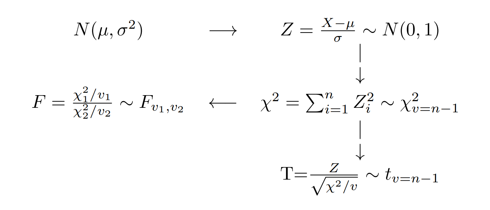

```{r setup, include=FALSE}
knitr::opts_chunk$set(echo = TRUE, message = FALSE, warning = FALSE, comment = NA)
library(psych)
library(summarytools)

# install.packages("devtools")
#devtools::install_github("dgonxalex80/paqueteDEG")
#library(paqueteDEG)

# colores
c0= "#F7AA00"
c1= "#235784"
c2= "#40A8C4"
c3= "#EEF6F7"

c4= "#11224D"
c5= "#5B84C4"


```

<br/><br/>


```{r, echo=FALSE, out.width="80%", fig.align = "center"}
knitr::include_graphics("img/valiente3.gif")
```

<center>
<sub>
Tomado de : Valiente Disney Channel
</sub>
</center>


<br/>

# **Distribuciones muestrales**

<br/>

Cuando se toma una muestra aleatoria y se calcula un estimador, se obtiene un valor numérico que declaramos se aproxima al valor del parámetro considerado. El valor encontrado corresponde a una realización del estimador y está asociado a una muestra determinada, pero surgirán tantos valores como muestras podamos seleccionar y por tal razón el estimador constituye una variable aleatoria.

Como variables aleatoria posee las priedades :

* $E[\widehat{\theta}]$  valor esperado
* $V[\widehat{\theta}]$ varianza
* $f_X(x)$ función de densidad de probabilidad
* $F_{X}(x)$ función de probabilidad acumulada

<br/><br/>

## **Principales distribuciones muestrales:** 

<br/>

Empezaremos con las principales distrubuciones asociadas a los estimadores de los parámetros:

|                            |  estimador                           |  parámetro                      |distribuciones asociadas   |
|:---------------------------|:-------------------------------------|:--------------------------------|:--------------------------|
| media                      | $\overline{X}$                       | $\mu$                           |normal estandar,           |
|                            |                                      |                                 |t-Student                  |  
| proporción                 | $\widehat{p}$                        | $p$                             |normal estandar            |
| varianza                   | $S^{2}$                              | $\sigma^{2}$                    |chi-cuadrado               |
| diferencia de medias       | $\overline{X}_{1}- \overline{X}_{1}$ | $\mu_1 - \mu_2$                 |normal estandar,           |
|                            |                                      |                                 |t-Student                  |
| diferencia de proporciones | $\widehat{p_{1}} -  \widehat{p_{2}}$ | $p_1 - p_2$                     |normal estandar            |
| razón de varianzas         | $S^{2}_{1}/ S^{2}_{2}$               | $\sigma^{2}_1 / \sigma^{1}_2$   |  F                        |   


Existe una relación importante entre ellas con la Distribución normal, las cuales se representan en el siguiente diagrama:

<br/><br/>


```{r, echo=FALSE, out.width="60%", fig.align = "center"}

```

<br/><br/>

Si una variable **X** se distribuye **normal** con parámetros $\mu$ y $\sigma^{2}$, entonces a partir de su transformación se puede obtener una variable **Z** que tenga distribución **normal estándar** $N(0,1)$, que tiene media cero y varianza uno. Varias normales estándar al cuadrado conforman una variable con distribución **chi-cuadrado** y a su vez esta variable tiene la propiedad tal que la suma de $n$ variables aleatorias $\chi^{2}$ con $n-1$ grados de libertad. La razón de una variable con distribución normal estándar y la raiz cuadrada de una variable chi-cuadrado, dividida por sus grados de libertad originan una variable con distribución **t-student**. Por último la razón de dos variables con distribución chi-cuadrado, divididas cada una por sus respectivos grados de libertad, generan una variable con distribución  **F-Fisher**. 

<br/>

En sintesis, la distribuciones de muestreo básicas, tienen de base la distribución normal.

<br/><br/>

<br/><br/>

### **Distribución chi-cuadrado** 

<br/>

Si $S^{2}$ es la varianza de la muestra aleatoria de tamaño $n$ que se toma de una población normal que tiene varianza $\sigma^{2}$, entonces el estadístico:

<br/>

$$\chi^{2}=\frac{(n-1)S^{2}}{\sigma^{2}}=\sum_{i=1}^{n}\frac{\big(x_{i}-\bar{x}\big)^{2}}{\sigma^{2}}=\sum_{i=1}^{n} \Big(\frac{x_{i}-\bar{x}}{\sigma}\Big)^{2} $$

tiene una distribución chi-cuadrado con $v=n-1$ grados de libertad.

<br/><br/>

<div class="content-box-blue">

### **NOTA:** 

Esta función fue creada por Karl Pearson cientifico inglés (1857-1936) y su función de distribución y su represntación gráfica estan dadas por:

$$f(x)=\frac{1}{2^{(v/2)}\Gamma(v/2)}x^{(v/2)-1}\exp\{-x/2\} ,\hspace{.3cm} x>0$$


</div>

<br/><br/>

```{r, echo=FALSE}
 curve(dchisq(x, df=7), lwd=3, las=1,xlim = c(0,30), ylim=c(0,.13), ylab='Densidad', col="red",axes = FALSE)
curve(dchisq(x, df=9), lwd=3, las=1,xlim = c(0,30), ylab='Densidad',add = TRUE, col="blue")
curve(dchisq(x, df=11), lwd=3, las=1,xlim = c(0,30), ylab='Densidad',add = TRUE, col="green")
abline(h=0)
grid()
```

Esta distribución es un caso especial de la distribución Gamma con parámetros $\alpha=\frac{v}{2}$ y $\beta=2$ 

<br/><br/>

### **Distrución t-student**

<br/>

Esta función nace de la relación entre una variable con distrución normal estandar y la raiz cuadrada de una variable con distribución chi-cuadrado
Sea Z una variable con distribución normal estandar y V una variable con distribución chi-cudadrado con v grados de libertad, entonces la variable aleatoria T se distribuye t-student con v grados de libertad

$$T=\frac{Z}{\sqrt{V/v}} \sim t_{v}$$


<div class="content-box-blue">

### **NOTA**

Esta función de distribución fue propuesta por William Sealy Gosset en 1908. Gosset trabajaba en una fábrica de cerveza de prppiedad de Guiness, quien prohibia a sus empleados la publicación de artículos cientificos debido a la difución previa de secretos industriales. Debido a esta prohibición Gosset publicaba sus artículos con el seudonimo de Student.(Wikipedia.org)


La función de probabilidad de distribución t-student y su represntación gráfica están dadas por:

$$f(x)=\frac{\Gamma[(v+1)/2]}{\Gamma[v/2]\sqrt{\pi v}}\Bigg(1+\frac{x^{2}}{v} \Bigg)^{-(v+1)/2}, \hspace{.3cm} -\infty< x<\infty $$
</div>

```{r, echo=FALSE}
 curve(dt(x, df=1), lwd=3, las=1,xlim = c(-4,4), ylim=c(0,0.4), ylab='Densidad', col="red",axes = FALSE)
curve(dt(x, df=5), lwd=3, las=1,xlim = c(-4,4), ylab='Densidad',add = TRUE, col="blue")
curve(dt(x, df=20), lwd=3, las=1,xlim = c(-4,4), ylab='Densidad',add = TRUE, col="green")
abline(h=0)
grid()
```

La gráfica de la distribución t-student es similar a la de la distribución normal, salvo que sus colas son más pesadas.

Si $X_{1},X_{2},...,X_{n}$ es una muestra aleatoria de $n$ variables independientemente e idénticamente distribuidas $N(\mu,\sigma^{2})$ y

$$\bar{X}=\frac{1}{n}\sum_{i=1}^{n}X_{i} $$

$$S^{2}=\frac{1}{n-1}\sum_{i=1}^{n}\Big(X_{i}-\bar{X}\Big)^{2} $$

Entonces la variable aleatoria:

$$T=\frac{\bar{X}-\mu}{S/\sqrt{n}} $$

tiene una distribución t-student con $v=n-1$ grados de libertad

<br/><br/>

### **Distribución F-Fisher**

<br/>

Si $S_{1}^{2}$ y $S_{2}^{2}$ son las dos varianzas de muestras aleatorias independientes de tanaños $n_{1}$ y $n_{2}$ tomadas de poblaciones normales con varianzas $\sigma_{1}^{2}$ y $\sigma_{2}^{2}$ respectivamente, entonces:

$$F=\frac{S_{1}^{2}/\sigma_{1}^{2}}{S_{2}^{2}/\sigma_{1}^{2}}=\frac{\sigma_{2}^{2}}{\sigma_{1}^{2}} \frac{S_{1}^{2}}{\sigma_{2}^{2}} $$

tiene una distribución F con grados de libertad $v_{1}=n_{1}-1$ y $v_{2}=n_{2}-1$

<div class="content-box-blue">

### **NOTA**
Ronald Aylmer Fisher (1890-1962) cientifico, matemático, estadístico, biólogo evolutivo y genet?sta inglés fue el creador de la distribución F. Su función de distribución y su representación gráfica estan dadas por:

$$f(x)=\displaystyle\frac{\Gamma \Bigg[\displaystyle\frac{v_{1}+v_{2}}{2}\Bigg]\Bigg(\displaystyle\frac{v_{1}}{v_{2}}\Bigg)^{v_{1}/2} x^{(v_{1}/2)-1}}{\Gamma \Bigg[\displaystyle\frac{v_{1}}{2}\Bigg] \Gamma \Bigg[\displaystyle\frac{v_{2}}{2}\Bigg]
\Bigg[\Bigg(\displaystyle\frac{v_{1}}{v_{2}}\Bigg)x+1\Bigg]^{\big(v_{1}+v_{2}\big)/2}}, \hspace{.3cm} x>0 $$

</div>

```{r, echo=FALSE}
 curve(df(x, df1=5, df2=10), lwd=3, las=1,xlim = c(0,5), ylim=c(0,1), ylab='Densidad', col="red",axes = FALSE)
curve(df(x, df1=10, df2=25), lwd=3, las=1,xlim = c(0,5), ylab='Densidad',add = TRUE, col="blue")
curve(df(x, df=20, df2=20), lwd=3, las=1,xlim = c(0,5), ylab='Densidad',add = TRUE, col="green")
abline(h=0)
grid()
```


<br/><br/>

## **La media muestral**

<br/>

$$ \bar{X}=\frac{1}{n}\sum_{i=1}^{n} X_{i}$$

Al hablar de distribución de probabilidad de la media muestral, implicitamente estamos afirmando que $\bar{X}$, es una variable aleatoria. De esta variable a continuación estudiaremos sus principales caracteristicas. 

Para verificar las propiedades de este estimador podemos hacer uso de las propiedades del valor esperado de la siguiente manera:

$$\begin{eqnarray*}
E[\bar{X}] &=& E\Bigg[ \frac{1}{n} = \frac{1}{n} E\Big[X_{1}+X_{2}+\cdots + X_{n}\Big]\\
&=&\frac{1}{n} [\mu + \mu \cdots + \mu ] = \frac{1}{n} n\mu = \mu\\
\end{eqnarray*}$$

por tanto:

$$\mu = \mu_{\bar{X}}$$

Como conclusión obtenemos que la media de la media muestral es igual a la media de la variable. 

Con la varianza ocurre algo similar al utilizar las propiedades de la varianza:

$$\begin{eqnarray*}
V[\bar{X}]&=&V\Bigg[\frac{1}{n} \sum_{i=1}^{n} x_{i}\Bigg] \\
&=&\dfrac{1}{n^{2}} V\big[X_{1}+X_{2}+\cdots + X_{n}\big] \\
&=& \dfrac{1}{n^{2}} V[X_{1}]+V[X_{2}]+\cdots +V[X_{n}]\\
&=& \dfrac{1}{n^{2}} n\sigma^{2}\\
&=& \dfrac{\sigma^{2}}{n}
\end{eqnarray*}$$

Se concluye que:

$$V[\bar{X}] = \dfrac{\sigma^{2}}{n}$$

Obtenemos así que la varianza de la media muestral es igual a la varianza de la variable. \\


Para verificar estas caracteristicas, vamos a suponer que tenemos una población de N=5, conformada por los elementos: $10,20,30,40,50$. Para esta población podemos calcular sus parametros $\mu$ y $\sigma^{2}$.

$$\begin{eqnarray*}
\mu_{_{X}}&=&\dfrac{1}{5}\sum_{i=1}^{5}x_{i} =\dfrac{(10+20+30+40+50)}{5}=30 \\
\sigma^{2}_{_{X}}&=&\sum_{i=1}^{5}\dfrac{1}{5}\big(x_{i}-30 \big)^{2} =\dfrac{1}{5}\Big[ \big(10-30\big)^{2} + ...\\
& &\big(20-30 \big)^{2}+ ....\big(50-30 \big)^{2} \Big]=\dfrac{1000}{5}=200
\end{eqnarray*}$$

Ahora estudiaremos la población de muestras que se pueden obtener de esta población de tamaño $n=2$ tomadas con reemplazo (probabilidad constante)

En la practica el muestreo se realiza sin remplazo y debido a que el tamaño de la población es grande o es considerado como infinito, hace que la probabilidad de seleccionar un objeto de la población se pueda considerar como constante .

<br/><br/>


|  muestra |  $\bar{x}$ |  muestra | $\bar{x}$ |  muestra |  $\bar{x}$ |  muestra | $\bar{x}$ | muestra  | $\bar{x}$ |
|:--------:|:----------:|:--------:|:---------:|:--------:|:----------:|:--------:|:---------:|:--------:|:---------:|
| (10,10)  |  10        | (20,10)  | 15        | (30,10)  |  20        | (40,10)  |  25       |  (50,10) |  30       |  
| (10,20)  |  15        | (20,20)  | 20        | (30,20)  |  25        | (40,20)  |  30       |  (50,20) |  35       |
| (10,30)  |  20        | (20,30)  | 25        | (30,30)  |  30        | (40,30)  |  35       |  (50,30) |  40       |    
| (10,40)  |  25        | (20,40)  | 30        | (30,40)  |  35        | (40,40)  |  40       |  (50,40) |  45       |
| (10,50)  |  30        | (20,50)  | 35        | (30,50)  |  40        | (40,50)  |  45       |  (50,50) |  50       |

<br/><br/>

Estos valores conforman la población de muestras de tamaño n=2 que se pueden obtener sin reemplazo de la población inicial, En este caso podemos calcular la media y la varianza poblacional de $\bar{X}$

$$\begin{eqnarray*}
\mu_{_{\bar{X}}}&=& \dfrac{1}{25}(10+15+20+...50) = 30 \\
\sigma^{2}_{_{\bar{X}}}&=& \dfrac{1}{25} \Big[\big(10-30\big)^{2} +...+\big(50-30\big)^{2} \Big]=100
\end{eqnarray*}$$

De estos resultados podemos concluir que:

* La media poblacional de la variable aleatoria $X$ es idéntica a la media de la media poblacional de la media $\bar{X}$

$$\mu_{_{X}} = \mu_{_{\bar{X}}}$$

* La varianza poblacional de $\bar{X}$ es igual la varianza de $X$ dividido por el tamaño de la muestra

$$\sigma^{2}_{_{\bar{X}}} = \dfrac{\sigma^{2}_{_{X}}}{n}$$


Si el muestreo se realiza sin reemplazo la población de muestras de tamaño n=2, estaria conformado por:

<br/><br/>

|  muestra |  $\bar{x}$ |  muestra | $\bar{x}$ |  muestra |  $\bar{x}$ |  muestra | $\bar{x}$ | muestra  | $\bar{x}$ |
|:--------:|:----------:|:--------:|:---------:|:--------:|:----------:|:--------:|:---------:|:--------:|:---------:|
|(10,20)   | 15         | (10,40)  | 25        | (20,30)  |   25       | (20,50)  | 35        |  (30,50) | 40        |
|(10,30)   | 20         | (10,50)  | 30        | (20,40)  |   30       | (30,40)  | 35        |  (40,50) | 45        |

<br/><br/>

En este caso la media y la varianza de esta población son:
$$\begin{eqnarray*}
\mu_{_{\bar{X}}}&=& \dfrac{1}{10}(15+20+...45) = 30 \\
\sigma^{2}_{_{\bar{X}}}&=& \dfrac{1}{10} \Big[\big(15-30\big)^{2} +...+\big(45-30\big)^{2} \Big]=75
\end{eqnarray*}$$

La diferencia presentada en la varianza, se debe a que se trata de una muestra grande en relaciona a la población ($\frac{n}{N}=\frac{2}{5}=0.20$). El haber realizado el muestreo sin repetición cambia la probabilidad del segundo elemento y generando un cambio en la varianza. En este caso se debe corregir el valor obtenido para obtener el valor correcto de la varianza multiplicando la varianza por **fcpf** factor de corrección por población finita

$$\sigma^{2}_{_{\bar{X}}} \times \dfrac{(N-n)}{(N-1)} =100 \times \dfrac{(5-2)}{(5-1)}=75$$

$$\text{fcpf:} \dfrac{(N-n)}{(N-1)}$$

<br/><br/>


### **EJEMPLO**

<br/>

Cierto tipo de batería para automóviles dura un promedio de 1110 días con una desviación estandar de 80 días. Si se eligen n=400 de estas baterías de manera aleatoria, encuentre la probabilidad de que el promedio sea mayor a 1120 días y halle el percentil 80 para esta distribución.
Como $X \sim N(\mu=1110, \sigma^{2}=80^{2})$, utilizando las propiedades verificadas anteriormente podemos afirmar que: $\bar{X} \sim N(\mu=1110, \sigma_{\bar{X}}=80/\sqrt{400})$

$$\begin{eqnarray*}
P(\bar{x} > 1120) &=& P\Bigg(\dfrac{\bar{x}-\mu}{\sigma/\sqrt{n}} > \dfrac{1120-1110}{80/\sqrt{400}}\Bigg)\\
&=& P(Z > 2.5)\\
&=& 1-P(Z < 2.5)\\
&=& 1-0.9938 \\
&=& 0.0068
\end{eqnarray*}$$

<br/><br/><br/><br/>

## **La proporción muestral**

<br/>

Al igual que en la media podemos realizar la verificación con la proporción, mediante la utilización de la siguiente población. Supongamos que en una población compuesta por 5 personas ($N=5$) tres de ellas son profesonales y queremos estudiar $p$ la proporción de profesionales en la muestra. En términos de variable seria: $S_{1}, N_{2}, N_{3}, S_{4}, S_{5}$, con el fin de distinguir las personas colocaremos un subindice. Con esta información podemos calcular los valores poblacionales:

$$p=\dfrac{3}{5}=0.6$$

$$pq=p(1-p)=0.6 \times 0.4 = 0.24$$

Podemos obtener la población de proporciones muestrales ($\widehat{p}$) de tamaño $n=2$

<br/><br/>

|muestra |$\widehat{p}$ |  muestra|$\widehat{p}$|muestra|$\widehat{p}$|muestra|$\widehat{p}$ | muestra|$\widehat{p}$ |
|:-------------:|:-----:|:-------------:|:----:|:-------------:|:----:|:-------------:|:----:|:-------------:|------:|
|$(S_{1},S_{1})$|$1.0$  |$(N_{3},S_{4})$|$0.5$ |$(S_{1},N_{2})$|$0.5$ |$(N_{3},S_{5})$|$0.5$ |$(S_{1},N_{3})$|$0.5$  |
|$(S_{4},S_{1})$|$1.0$  |$(S_{1},S_{4})$|$1.0$ |$(S_{4},N_{2})$|$0.5$ |$(S_{1},S_{5})$|$1.0$ |$(S_{4},N_{3})$|$0.5$  | 
|$(N_{2},S_{1})$|$0.5$  |$(S_{4},S_{4})$|$1.0$ |$(N_{2},N_{2})$|$0.0$ |$(S_{4},S_{5})$|$1.0$ |$(N_{2},N_{3})$|$0.0$  |
|$(S_{5},S_{1})$|$1.0$  |$(N_{2},S_{4})$|$0.5$ |$(S_{5},N_{2})$|$0.5$ |$(N_{2},S_{5})$|$0.5$ |$(S_{5},N_{3})$|$0.5$  | 
|$(N_{3},S_{1})$|$0.5$  |$(S_{5},S_{4})$|$1.0$ |$(N_{3},N_{2})$|$0.0$ |$(S_{5},S_{5})$|$1.0$ |$(N_{3},N_{3})$|$0.0$  |

<br/><br/>

De esta población tenemos que:

$$\mu_{\widehat{p}}=\dfrac{15}{25}=0.6$$

$$V[\hspace{.1cm}\widehat{p}\hspace{.1cm}]=\frac{3}{25}=0.12$$

Con este resultado estamo verificando que se cumple que:

$$E[\hspace{.1cm}\widehat{p}\hspace{.1cm}]= p$$

$$V[\hspace{.1cm}\widehat{p}\hspace{.1cm}] =\dfrac{p(1-p)}{n}$$

<br/><br/>

### **EJEMPLO**

<br/>

La proporción de individuos con tipo de sangre Rh positivo es de 85%. Si se tiene una muestra de $n=500$ individuos, Encuentre la probabilidad de que la proporción muestral $\widehat{p}$ pase de 82%.
Cuando el tamaño de muestra es grande, la distribución de la proporción se aproxima a una distribución normal con media $p$ y varianza $p(1-p)/n$. De esta manera podemos hallar la probabilidad solicitada:

$$\begin{eqnarray*}
P(\widehat{p}>0.82) &=& P\Bigg(\dfrac{\widehat{p}-p}{(p(1-p)/\sqrt{n}} > \dfrac{0.82 - 0.84}{\sqrt{(0.85 \times 0.15)/500}}\Bigg) \\
&=& P\big(Z > -1.878 \big) \\
&=& 1 - P(Z < -1.88)\\
&=& 1-0.0301
\end{eqnarray*}$$

<br/><br/>

## **La varianza muestral**.

<br/>

Ahora tenemos interes en estudiar el comportamiento de $S^{2}$ llamada cuasivarianza por algunos y definida por:
$$\widehat{\sigma^{2}}=S^{2}=\dfrac{1}{(n-1)}\sum_{i=1}^{n}\big(x_{i}-\bar{x}\big)^{2}$$


Se puede demostrar que:

$$E[S^{2}] = \sigma^{2}$$


$$V[S^{2}] = \dfrac{2\sigma^{4}}{(n-1)}$$


Pero también que:

$$\dfrac{(n-1) S^{2}}{\sigma^{2}} \sim \chi^{2}_{(v=n-1)} $$


<div class="content-box-blue">
### **NOTA:**

Revisar : Canavos(1988) pp.231

</div>


<br/><br/><br/><br/>

## **Algunos estimadores**

<br/>

| Parámetro         |  Estimador                        | Valor esperado              | Varianza                                              |
|:-----------------:|:---------------------------------:|:---------------------------:|:-----------------------------------------------------:|
| $\theta$          | $\widehat{\theta}$                | $E[\widehat{\theta}]$       | $V[\widehat{\theta}]$                                 |
| $\mu$             | $\bar{x}$                         |  $\mu$                      | $\displaystyle\frac{\sigma^{2}}{n}$                   |
| $p$               | $\widehat{p}=\frac{X}{n}$         | $p$                         | $\displaystyle\frac{pq}{n}$                           |
|$\sigma^{2}$       | $S^{2}=\displaystyle\frac{\displaystyle\sum_{i=1}^{n}(x-\bar{x})^{2}}{n-1}$ | $\sigma^{2}$|$\dfrac{2\sigma^{4}}{(n-1)}$ |
|$\mu_{1}-\mu_{2}$  | $\bar{x}_{1}-\bar{x}_{2}$         | $\mu_{1}-\mu_{2}$         |$\dfrac{\sigma^{2}_{1}}{n_{1}}+\dfrac{\sigma^{2}_{2}}{n_{2}}$ |
|$p_{1}-p_{2}$      | $\widehat{p_{1}}-\widehat{p_{2}}$ | $p_{1}-p_{2}$               |$\dfrac{p_{1}q_{1}}{n_{1}}+\dfrac{p_{2}q_{2}}{n_{2}}$ |


<br/><br/><br/>


## **Teorema central del límite**: 

<br/>

Si $\bar{X}$ es la media de una muestra de tamaño $n$ tomada una población con media $\mu$ y varianza $\sigma^{2}$, entonces la forma límite de la distribución de :
$$Z=\dfrac{\bar{X}-\mu}{\Big(\sigma/\sqrt{n}\Big)} \sim N(0,1) $$

conforme $n\rightarrow \infty$, esta aproximación es cada vez más próxima a la normal. Este teorema es aplicable tambien a la variable total de sumatoria de los valores de la muestra $T_{n}=X_{1}+X_{2}+...+X_{n}$


El potencial de este teorema esta en que no importa la distribución de la variable X, la distribución de la media provemiente de la muestra tomada de esta población se distribuye aproximadamente normal. Al final de la guía se encuentra practica computacional que nos ayuda a comprender el alcance de este teorema.

<br/><br/>


Se puede notar la transformación de la distribución de la media a una distribución normal a medida que el tamaño de muestra aumenta

<br/><br/><br/><br/>

## **Video** 

<br/>

<center>
<iframe width="560" height="315" src="https://www.youtube.com/embed/jbrnCa3jq0Y" title="YouTube video player" frameborder="0" allow="accelerometer; autoplay; clipboard-write; encrypted-media; gyroscope; picture-in-picture" allowfullscreen></iframe>
</center>

