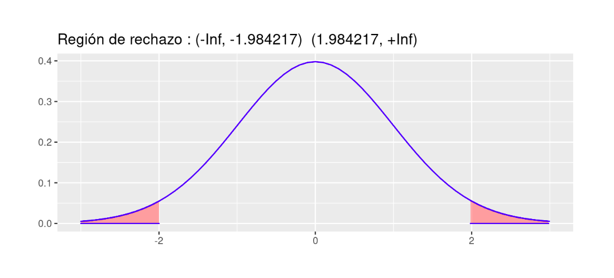

```{r setup, include=FALSE}
knitr::opts_chunk$set(echo = TRUE, comment = NA)

c1 ="#FF7F00"  # naranja - color primario 
c2 ="#034A94"  # azul oscuro - color secundario
c3 ="#0EB0C6"  # azul claro - color terciario
c4 ="#686868"  # gris - color texto
```


```{r, echo=FALSE, out.width="100%", fig.align = "center"}
knitr::include_graphics("img/banner_guia.png")
```


```{r, echo=FALSE, out.width="100%", fig.align = "center"}
knitr::include_graphics("img/decision.png")
```

<br/><br/>

## **Introducción**

```{r, echo=FALSE, out.width="50%", fig.align = "center"}

```

<br/><br/>

El origen de los estudios, relacionados con las pruebas de hipótesis estadísticas, se sitúa alrededor de 1738, cuando en un ensayo escrito por Daniel Bernoulli(1) aparece el cálculo una estadística de prueba para ensayar su hipótesis en el campo de la astronomía. Entre 1915 y 1933 se desarrolla esta formulación gracias a los estudios realizados por tres grandes autores: Ronald Fisher(2), Jerzy Neyman(3) y Egon Pearson(4). Hoy en día predomina la teoría de Neyman-Pearson (lema de Neyman-Pearson).


```{r, echo=FALSE, out.width="30%", fig.align = "center"}
knitr::include_graphics("img/prueba.jpg")
```

<center>
<sub>
Tomada de : https://pixabay.com/es/
</sub>
</center>

<br/><br/>

Una hipótesis estadística es una afirmación o conjetura acerca de los parámetros de la distribución de probabilidades de una población. Si la hipótesis estadística especifica completamente la distribución, entonces ella se llama **Hipótesis Simple**, de otra manera se llama Hipótesis Compuesta. 

Desde el punto de vista clásico, todas las pruebas de hipótesis trabajan en base a ciertos principios que consideran:

+ Hipótesis nula (**Ho**)
+ Hipótesis alterna (**Ha**)
+ Estadístico de Prueba (**EdeP**)
+ Región de Rechazo (**RdeR**)
+ Regla de Decisión(**RD**)

<br/><br/>

## **Conceptos básicos** 

<br/><br/>

<div style="padding: 15px; border: 1px solid transparent; border-color: transparent; margin-bottom: 20px; border-radius: 4px; color: #000000; background-color: #CEE8EE; border-color: #000000;">
### **Hipótesis Nula (Ho)** 

Es la hipótesis a probar, ésta NO se rechaza si de la muestra no se obtiene suficiente evidencia para rechazarla.

</div>

<br/><br/>

<div style="padding: 15px; border: 1px solid transparent; border-color: transparent; margin-bottom: 20px; border-radius: 4px; color: #000000; background-color: #CEE8EE; border-color: #000000;">

### **Hipótesis Alterna (Ha)** 

La hipótesis `Ho` se contrasta con la hipótesis Ha, y ésta última corresponde a valores alternativos del parámetro planteados en la hipótesis nula. La hipótesis $Ha$ se considera cierta si existe suficiente evidencia para rechazar la hipótesis nula.

</div>

<br/><br/>

<div style="padding: 15px; border: 1px solid transparent; border-color: transparent; margin-bottom: 20px; border-radius: 4px; color: #000000; background-color: #CEE8EE; border-color: #000000;">

### **Estadístico de Prueba**  

Es una función de la muestra que contiene información sobre el parámetro de interés, la que nos permite decidir sobre el rechazo de la hipótesis nula, `Ho`. Es tambien una variable aleatoria que sigue una función de distribución conocida como por ejemplo:

Para una muestra determinada se obtiene un valor del estadístico de prueba, a partir del cálculo y se determina el rechazo o no, de la hipótesis nula.


</div>
<br/><br/>


### **Región de Rechazo (RdeR)**  

También llamada región crítica (`RC`), define los valores del estadístico de prueba para los cuales la información muestral contradice la hipótesis nula. Estos valores nos permitirán adoptar una regla de decisión consistente. Una prueba de una hipótesis estadística es un procedimiento que permite, mediante el contraste entre la información muestral y lo propuesto en una hipótesis, decidir sobre
su rechazo. 

Una prueba de una hipótesis estadística es un procedimiento que permite, mediante el contraste entre la información muestral y lo propuesto en una hipótesis, decidir sobre
su rechazo. 

<br/><br/>

### **Regla de Decisión (RD)**  

De esta manera, como una regla de decisión, si para una muestra particular el estadístico de prueba (valor calculado) cae dentro de la región crítica, rechazaremos la hipótesis nula `Ha` en favor de la hipótesis alternativa `Ha`. En cambio, si el valor calculado no cae dentro de la RC, no podremos rechazar la hipótesis nula y por tanto decimos que la información contenida en la muestra no ofrece suficiente evidencia estadística que nos permita rechazar` `Ho`, ASUMIMOS que la hipótesis nula es cierta. 

<br/><br/>

### **Errores asociados**

Cuando se decide ya sea en favor o en contra de una determinada prueba de hipótesis, es posible estar en una de las cuatro situaciones descritas en la siguiente tabla:


<!-- |                   |  **Estado de la naturaleza**    |                                 | -->
<!-- |:------------------|:--------------------------------|:--------------------------------| -->
<!-- |                   |  **Ho es verdadera**            | **Ho es falsa**                 | -->
<!-- | **Decisión sobre la hipótesis**|                    |                                 | -->
<!-- |                   |                                 |                                 | -->
<!-- |Rechazar $Ho$      | **Error tipo I**                | **Decisión correcta**           | -->
<!-- |                   | P(Error tipo I) = $\alpha$      | $1-\beta$ : Potencia            | -->
<!-- |                   |                                 |                                 | -->
<!-- |No rechazar $Ho$   | **Decisión correcta**           | **Error tipo II**               | -->
<!-- |                   |                                 | P(Eror tipo II) =$\beta$        | -->
<!-- |                   |                                 |                                 | -->


```{r, echo=FALSE, out.width="80%", fig.align = "center"}
knitr::include_graphics("img/errores.png")
```


Existen dos situaciones en las que se comenten errores después de tomar una decisión:

<br/><br/>

**Error tipo I**: Cuando se rechazamos una hipótesis nula que en realidad es verdadera. Tomando como simil la situación donde un médico desea determinar si un paciente está sano o enfermo (`Ho`: SANO vs `Ha`: ENFERMO), es posible que concluya que el paciente está enfermo (rechace `Ho`) cuando en verdad esta persona esta sana. En términos de probabilidad este error se debe de representar como:
$$P(\text{Rechazar } Ho | Ho \text{ es verdadera})= \alpha$$


|                   |  **Error tipo I**    | 
|:------------------|:--------------------------------|
| |Para ilustrar el error tipo I, podeos acudir aun evento ocurrido a una estudiante que después de realizar una donación de sangre fue requerida por la clinica benefactora, pues el examen que le habían practicado a la sangre donada, presentaba signos de estar infectada por hepatitis c. Esto prendió las alarmas en la casa y fue llevada por la familia a que se le realizaran otros exámenes para confirmar el diagnostico inicial. Las segundas pruebas evidenciaron que se trataba de un error. Este caso constituye un caso de falso positivo (Se diagnostica como enferan, cuando en verdad esta sana) |


<br/><br/>

**Error Tipo II**: Cuando no se rechaza una hipótesis nula que en realidad es falsa. Utilizando el ejemplo del médico, diríamos que cuando el medico indica que el paciente esta sano, cuando esta realmente enfermo, incurre en un error frecuente cuando algunos pacientes son asintomáticos y aunque tienen la enfermedad, sus exámenes médicos salen negativos. En este caso la probabilidad se representa como:

$$P(\text{No rechazar} Ho | Ho \text{ es falsa}) $$


|                   |  **Error tipo II**              | 
|:------------------|:--------------------------------|
| |Para ilustrar el caso del error tipo II, recurrimos a lo acontecido en el Tour de Francia, donde el ciclista estadunidence Lance Armstrong gano esta competencia seis veces de manera consecutiva y aunque fue acusado de dopin, no se le pudo comprobar. Fue solo en el 2012 cuando el mismo admitió haber usado EPO. Podemos decir que durante su vida deportiva los exámenes practivados dieron negativos, estando el dopado. Este caso se cataloga como falso negativo. |

<br/><br/>

### **Nivel de significancia ($\alpha$)**  

No es posible minimizar simultáneamente, las probabilidades de los errores tipo I y II, ya que en la medida que uno disminuye el otro aumenta, como se muestra en la figura siguiente, en la que claramente se ve que la reducción del área $\alpha$ (probabilidad de error tipo I), implica el aumento del área $\beta$ (probabilidad de error tipo II).


<br/><br/><br/><br/>

# **Pruebas paramétricas**

Se llaman pruebas de hipótesis metrificaras debido a que para su realización se deben verificar el cumplimiento de supuestos sobre parámetros. 

<br/><br/>

## **P de H sobre una población**

Los parámetros más importante a los que se les realizan pruebas de hipótesis son : $\mu$, $p$ y $\sigma^{2}$, en el caso de una población :  

<br/><br/>

| parámetro    |  prueba de dos colas    | prueba de cola inferior| prueba de cola superior|
|:-------------|:------------------------|:-----------------------|:-----------------------|
|$\mu$         |$Ho: \mu = \mu_{o}$      |$Ho: \mu \geq \mu_{o}$  |$Ho: \mu \leq \mu_{o}$  |
|              |$Ha: \mu \neq \mu_{o}$   |$Ha: \mu < \mu_{o}$     |$Ha: \mu > \mu_{o}$     |
|              |                         |                        |                        |
|$p$           |$Ho: p = p_{o}$          |$Ho: p \geq p_{o}$      |$Ho: p \leq p_{o}$      |
|              |$Ha: p \neq p_{o}$       |$Ha: p < p_{o}$         |$Ha: p > p_{o}$         |
|              |                         |                        |                        |
|$\sigma^{2}$  |$Ho: \sigma^{2} = \sigma^{2}_{o}$   |$Ho: \sigma^{2} \geq \sigma^{2}_{o}$ |$Ho: \sigma^{2} \leq \sigma^{2}_{o}$|
|              |$Ha: \sigma^{2} \neq \sigma^{2}_{o}$|$Ha: \sigma^{2} < \sigma^{2}_{o}$   |$Ha: \sigma^{2} > \sigma^{2}_{o}$  |

<br/><br/>

### **Pruebas de hipótesis sobre una media**

Dependiendo de las condiciones podemos optar por tres diferentes EdeP para la realización de la prueba para una media, aunque tenemos una cuarta posibilidad en el caso de realizarla mediante un método no paramétrico:

<br/><br/>

```{r, echo=FALSE, out.width="80%", fig.align = "center"}

```


<br/><br/><br/>

|    |                                     |
|:--:|:------------------------------------|
|  | Un informe indica que el precio medio del pasaje de avión entre Cali  y San Andrés  es de \$120 mil pesos  y su desviación estándar de \$40 mil pesos. Se toma una muestra que se registra a continuación. ¿Se puede aceptar, con un nivel de significación igual a $\alpha=0.1$, las afirmaciones acerca de la media? |
  
165.1, 91.8, 128.3, 160.3, 103.6, 153.2, 50.7, 150.3, 160.8, 38.1, 98.8, 88.7, 123.1, 106.5, 79.5, 84.1, 216.1, 139.8, 98.4, 127.1, 103.0, 83.7, 158.8, 126.1, 113.4, 61.3, 79.8, 121.8, 89.9, 97.4, 134.0, 141.2, 154.3, 122.4, 107.6, 137.7, 121.0, 187.7, 56.8, 79.5, 183.8, 114.7, 80.2, 97.3, 113.8, 92.4, 123.5, 138.4, 114.7, 48.8, 178.1, 106.0, 103.1, 100.8, 180.7, 113.1, 121.4, 163.0, 51.4, 135.5,104.5, 202.1, 171.0, 100.7, 56.4, 99.7, 93.0, 118.3, 110.4, 136.9, 112.3, 69.8, 138.3, 87.2, 121.8, 118.6, 174.5, 77.7, 158.5, 85.3, 71.4, 63.0, 140.9, 126.9, 194.2, 136.7, 98.8, 222.5, 131.3, 175.0, 127.7, 88.5, 104.5, 144.7, 73.0, 97.2, 131.0, 120.5, 166.6, 96.0 . 

<br/>

**Solución**

Las pruebas a contrastar son:

$Ho: \mu= 120$ <br/>
$Ha: \mu \neq 120$ 

<br/><br/>

Antes de realizar la prueba debemos de determinar si la distribución de la población de precios es normal, para lo cual realizaremos la prueba de normalidad de Shapiro Wilk

$Ho: X \hspace{0.3cm}\sim norm$ <br/>
$Ha: X \hspace{.3cm} no \sim norm$ <br/>


```{r}
precio=c(165.1, 91.8, 128.3, 160.3, 103.6, 153.2, 50.7, 150.3, 160.8, 38.1, 98.8, 88.7, 123.1, 106.5, 79.5, 84.1, 216.1, 139.8, 98.4, 127.1, 103.0, 83.7, 158.8, 126.1, 113.4, 61.3, 79.8, 121.8, 89.9, 97.4, 134.0, 141.2, 154.3, 122.4, 107.6, 137.7, 121.0, 187.7, 56.8, 79.5, 183.8, 114.7, 80.2, 97.3, 113.8, 92.4, 123.5, 138.4, 114.7, 48.8, 178.1, 106.0, 103.1, 100.8,180.7,113.1,121.4,163.0,51.4,135.5,104.5,202.1,171.0,100.7, 56.4, 99.7, 93.0, 118.3, 110.4, 136.9, 112.3, 69.8, 138.3, 87.2, 121.8, 118.6, 174.5, 77.7, 158.5, 85.3, 71.4, 63.0, 140.9, 126.9, 194.2, 136.7, 98.8, 222.5, 131.3, 175.0, 127.7, 88.5, 104.5, 144.7, 73.0, 97.2, 131.0, 120.5, 166.6, 96.0)
```

```{r}
boxplot(precio, horizontal = TRUE, col = c2, xlab="precio ($000)")
```

<br/>

```{r}
shapiro.test(precio)
```

<br/>

De acuerdo con los resultados obtenidos en la prueba de Shapiro podemos suponer y aplicando la regla 3 (que se trata más adelante) podemos suponer que los datos siguen una distribucion aproximadamente normal. Cumplido este supuesto y al no tener conocimiento del valor de la varianza utilizaremos una prueba t para una media


```{r}
t.test(precio,
       alternative = "two.sided", # tipo de prueba
       mu = 120,                  # valor a contrastar
       conf.level = 0.90)         # nivel de confianza
```
<br/>

Para tomar una decisión sobre las hipótesis de acuerdo con los resultados podemos utilizar tres reglas:

<br/><br/>

**Regla 1** : Si el `EdeP` cae en la `RdeR`, entonce se RECHAZA la `Ho` y se **acepta** `Ha` como verdadera. Si por el contrario el `EdeP` NO cae en la `RdeR`, entonces NO SE RECHAZA `Ho`, no existe suficiente evidencia para rechazarla, **asumimos** que `Ho` es verdad.


En este caso es necesario determinar la región de rechazo (`RdeR`) de acuerdo al tipo de hipótesis y a la distribución del estadistico de prueba. En esta caso estamos realizando una prueba de dos colas, para un estadistico de prueba con distribución t-Student con 99 grados de libertad.

<br/><br/>

**Región de Rechazo** 

Para determinar la `RdeR`, a a prtir del nivel de significancia asumido, se buscan los percentiles $t_{0.025; v=59}$ y $t_{0.975;v=59}$ para la distribución t-Student.

```{r}
qt(c(0.025,0.975),99)
```

<br/>

```{r,eval=FALSE, fig.width=7, fig.height=3}
library(ggdistribute)
p=ggdistribution(dt, seq(-3, +3, 0.1), df = 99, colour = "blue")
p=ggdistribution(dt, seq(-3, qt(0.025,99), 0.1), df = 99, colour = 'blue', fill="red", p=p)   
p=ggdistribution(dt, seq(qt(0.975,99),+3, 0.1), df = 99, colour = 'blue', fill="red", p=p)+ 
     ggtitle("Región de rechazo : (-Inf, -1.984217)  (1.984217, +Inf)")
p
```


```{r, echo=FALSE, out.width="80%", fig.align = "center"}

```

<br/>

**Conclusión**: Como el `EdeP` (`t = -0.39343`) NO cae en la `RdeR`, entonces NO rechazamos `Ho`, asuminos `Ho` es verdadera, es decir $\mu$ de los precios es igual a 120 mil pesos. 


<br/><br/>

**Regla 2**: Si $\alpha >$ **valor-p** entonces rechazamos $H_{0}$, se **acepta** `Ha` como verdadera. Si por el contrario $\alpha <$ `valor-p`, no rechazamos `Ho`, **asumimos** 	que `Ho` es verdad. 

<br/><br/><br/>

### **Valor-p** 

El valor-p corresponde al área delimitada por el `EdeP` en el sentido que indica la `RdeR` de la prueba a contrastar. Es decir que corresponde a la probilidad  máxima de cometer `error tipo I`.

[Gil, Jacky F.; Castañeda, Javier A (2005)](https://www.redalyc.org/pdf/806/80634308.pdf) lo definen como :

*El resultado de la prueba de hipótesis se basa principalmente en el cálculo, en términos de probabilidad, de la fuerza de los hallazgos a favor de la hipótesis nula. Esta probabilidad recibe el nombre de valor-p, y se define como la probabilidad de cometer un falso positivo por efecto del azar, cuando la hipótesis nula es verdadera.*

<br/>

**Conclusión** : Como el valor de $\alpha >$ `valor-p`  (0.05 > p-value = 0.6949) entonces No se rechaza `Ho`, se `ASUME` que 	`Ho` es verdad. El promedio de los precios es igual a \$ 120.  

<br/><br/>

**Regla 3** : El `valor-p` se interpreta como el error que puedo cometer al rechazar `Ho`, siendo esta verdadera (cometer `error tipo I`). Si este valor es considerado como pequeño, rechazo `Ho`, se `ACEPTA` `Ha`. Si por el contrario se considera este valor grande, entonce no rechazo `Ho`, asumo que `Ho` es verdad.

<br/>

**Conclusión** : En este caso valoramos si el `valor-p` (p-value = 0.6949) es grande o pequeño. En esta caso se puede considerar que su valor es muy grande y por lo tanto no nos atrevemos a rechazar `Ho`, asumimos que $Ho$ es verdadera, es decir que la media de los precios es igual a \$ 120. 

|    |                                     |
|:--:|:------------------------------------|
|  | Al aplicar las últimas dos reglas (2 y 3) no se requiere la construcción de una $RdeR$ para tomar la decisión. Solo con revisar el valor-p entregado por la prueba y aplicar la regla se toma la decisión. En adelante utilizaremos las reglas 2 y 3 dado que al ejecutar las funciones  en R nos sumunistran información sobre valor-p.|

<br/><br/>

|    |                                     |
|:--:|:------------------------------------|
|  | Una operación en una línea de producción debe llenar cajas con detergente hasta un peso promedio de 32 onzas. Periódicamente se selecciona una muestra de cajas llenas, que se pesan para determinar a partir del promedio, si están faltas o sobradas de detergente. Si los datos de la muestra llevan a la conclusión de que les falta o sobra detergente, se debe parar la línea de producción y hacer los ajustes necesarios para que el llenado sea correcto. Con el fin de afianzar los conceptos expuestos, te invito a responder los siguientes interrogantes :|

(a.) Formule la hipótesis nula y alternativa que lleven a decidir si es conveniente parar y ajustar la línea de producción o no. 

(b.) Comente la conclusión a que se llegaría en caso de que no se rechazase  $Ho$ y cuando si ocurriese. 

(c.) Cuándo se comete error tipo I y cuando el tipo II. 

(d.) Bajo condiciones de distribución normal, determine la región de rechazo para una $\alpha= 0.05$ y para $\alpha= 0.08$  

<br/><br/>

### **Pruebas de hipótesis sobre una proporción**

En este caso debemos tener en cuenta que la muestra sea mayor a 30 con el fin de tener estimaciones mas robustas para estimar la proporción poblacional.


<br/><br/>

|    |                                     |
|:--:|:------------------------------------|
|  | Una empresa al seleccionar su personal, lo somete a un curso de entrenamiento. Por su experiencia se conoce que el 76% de los aspirantes aprueban el curso. Durante el último proceso, los encargados efectúan cambios al programa de entrenamiento, con el fin de realizar una selección más exigente. Para esta versión se inscriben 40 aspirantes de los cuales lo aprueban el proceso 24. ¿Podría afirmarse que los cambios realizados en el programa de entrenamiento reducen la selección? |

Debemos realizar una prueba de cola inferior debido al sentido que tienen la afirmación que queremos verificar *los cambios realizados en el programa de entrenamiento reducen la selección*. 

Ho: $p \geq 0.76$ <br/>   
Ha :$p < 0.76$   <br/>
<br/><br/>

```{r}
prop.test(24, 40, p = 0.76,
          alternative = "less",
          conf.level = 0.95)
```
<br/><br/>

**Conclusión**

Como el valor-p (p-value = 0.01447) es menor que el nivel de significancia ($\alpha=0.05$), rechazamos la hipótesis nula, aceptamos la hipótesis alterna. Podemos afirmar que $p<0.76$ . Tienen razón al afirmar que los cambios realizados en el proceso de selección provocaron una disminución significativa en la proporción de aprobación.

<br/><br/>


### **Pruebas de hipótesis sobre una varianza**

<br/><br/>

|    |                                     |
|:--:|:------------------------------------|
|  | Un fabricante de baterías para celulares afirma que el tiempo de duración de sus baterías se distribuyen aproximadamente normal con una desviación estándar de 9 horas. Un comprador antes de realizar un pedido de este producto solicita al fabricante una muestra de 10 baterías para verificar la información que le esta dando. Con este propósito son enviadas al laboratorio y se obtienen los siguientes datos Es cierta la información suministrada por el fabricante?  | 
|    | 11.1, 15.6, 11.1, 7.5, 7.9, 14.7, 6.3, 8.5, 8.0 , 7.6 |  

<br/>

```{r, eval=FALSE, fig.width=7, fig.height=3}
library(ggdistribute)
pRdeR=qchisq(c(0.025,0.975),9)
p=ggdistribution(dchisq, seq(0, 30, 0.1), df = 9, colour = 'blue')
p=ggdistribution(dchisq, seq(0, pRdeR[1], 0.1), df = 9, colour = 'blue', fill="blue", p=p)
p=ggdistribution(dchisq, seq(pRdeR[2], 30, 0.1), df = 9, colour = 'blue', fill="blue", p=p)+
       ggtitle("Región de rechazo:  (0; 2.70) (19.0, Inf) ")
p
pRdeR
```


```{r, echo=FALSE, out.width="80%", fig.align = "center"}
knitr::include_graphics("img/RdeR2.png")
```


```{r}
t=c(11.1, 15.6, 11.1, 7.5, 7.9, 14.7, 6.3, 8.5, 8.0 , 7.6)
varx=var(t)
EdeP=(length(t)-1)*varx/81
EdeP
```
<br/><br/>

**Conclusión**

Como el $EdeP$ (1.135074) caen en la $RdeR$, entonces rechazamos la hipótesis nula, aceptamos la hipótesis alterna como verdadera.

Podemos entonce concluir que $\sigma^{2} \neq 81$


<br/><br/><br/>


```{r, echo=FALSE, out.width="80%", fig.align = "center"}
knitr::include_graphics("img/formulario1.png")
```
