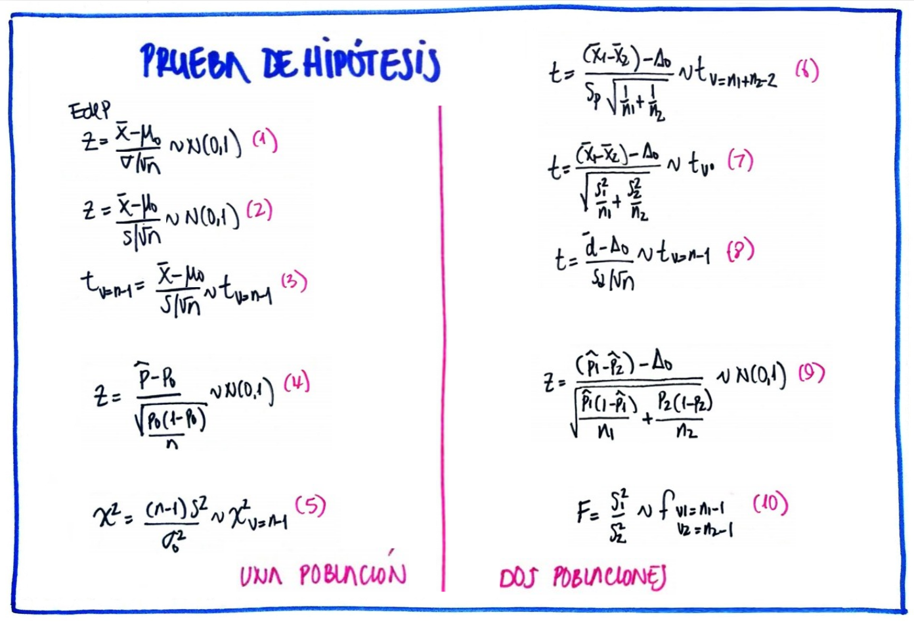
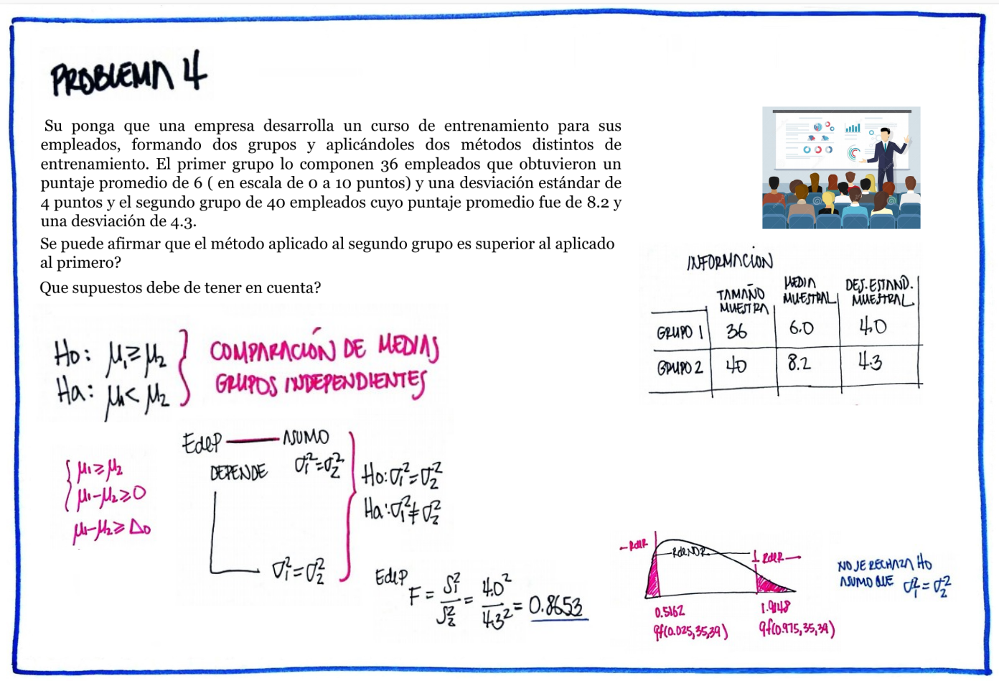
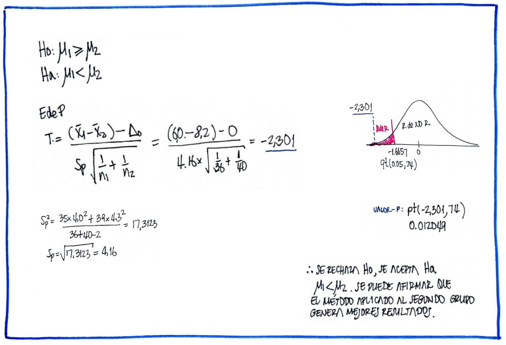
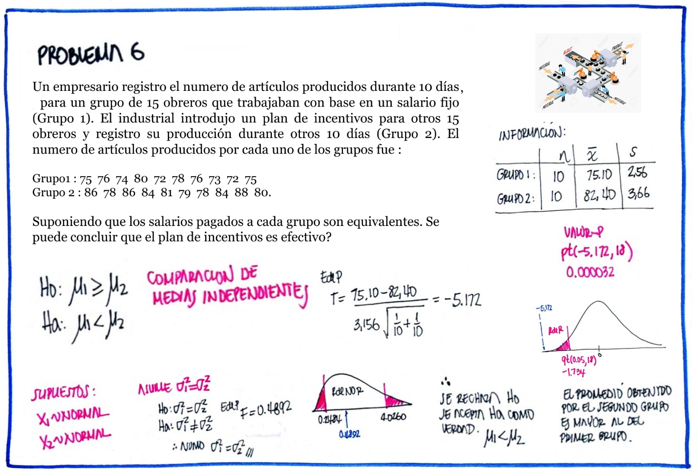
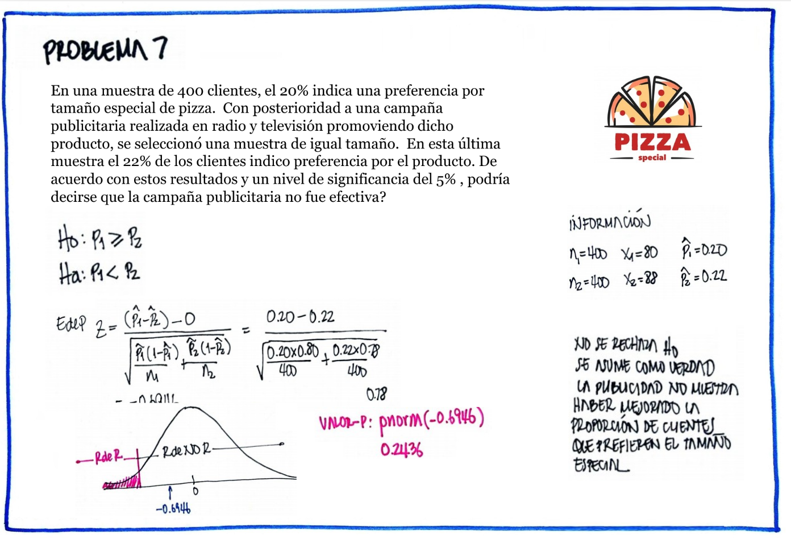
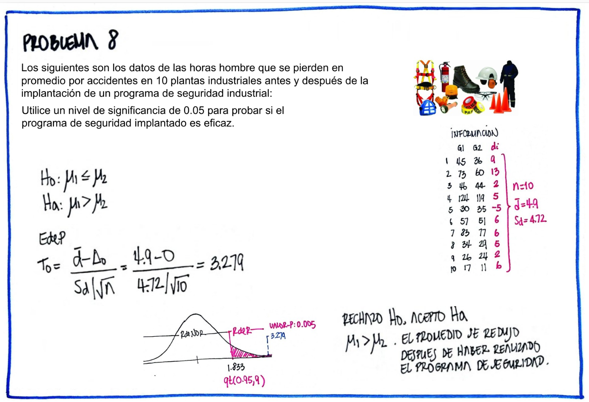
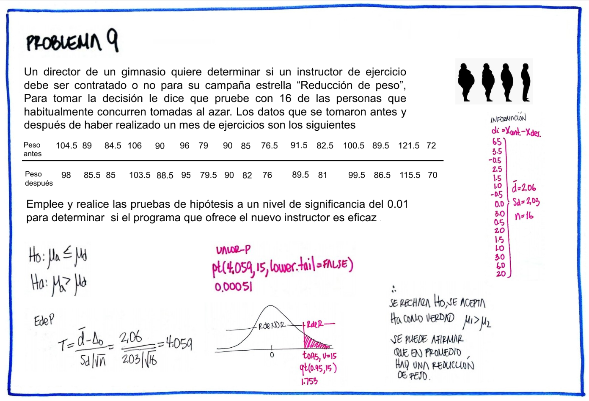
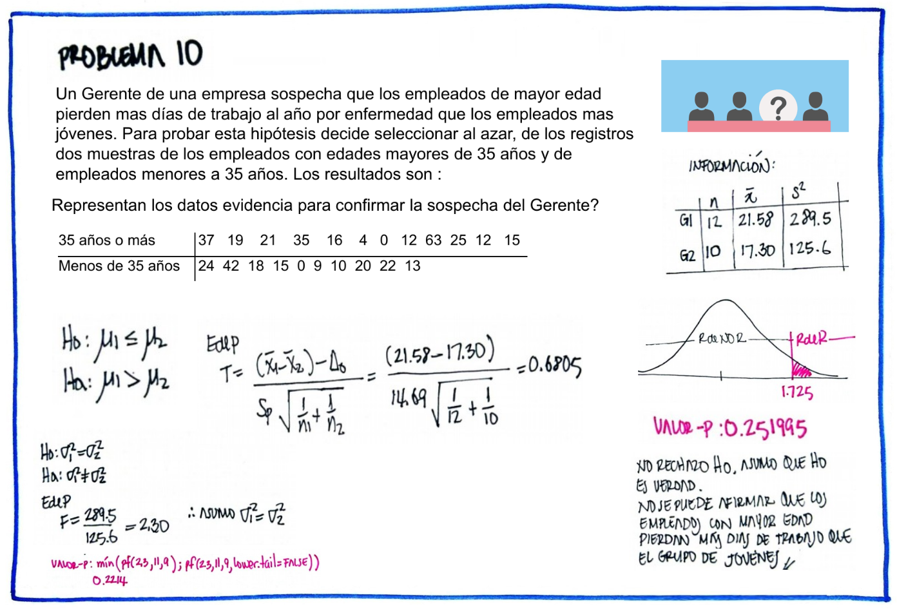

```{r setup, include=FALSE}
knitr::opts_chunk$set(echo = TRUE, comment = NA)

c1 ="#FF7F00"  # naranja - color primario 
c2 ="#034A94"  # azul oscuro - color secundario
c3 ="#0EB0C6"  # azul claro - color terciario
c4 ="#686868"  # gris - color texto
```


><br/><br/>


| parámetro       |  prueba de dos colas    | prueba de cola inferior| prueba de cola superior|
|:----------------|:------------------------|:-----------------------|:-----------------------|
|$\mu_{1}-\mu_{2}$|$Ho: \mu_{1}-\mu_{2}=\Delta_{o}$|$Ho: \mu_{1}-\mu_{2} \geq=\Delta_{o}$  |$Ho: \mu_{1}-\mu_{2}\leq\Delta_{o}$  |
|                 |$Ha: \mu_{1}-\mu_{2} \neq \Delta_{o}$|$Ha: \mu_{1}-\mu_{2} <\Delta_{o}$ |$Ha: \mu_{1}-\mu_{2} > \Delta_{o}$   |
|                 |                                  |                        |                        |
|                 |                                  |                        |                        |
|                 |                                  |                        |                        |
|$p_{1}-p_{2}$    |$Ho: p_{1}-p_{2} = \Delta_{o}$    |$Ho: p_{1}-p_{2} \geq\Delta_{o}$      |$Ho: p_{1}-p_{2} \leq \Delta_{o}$      |
|                 |$Ha: p_{1}-p_{2} \neq \Delta_{o}$ |$Ha: p_{1}-p_{2} < \Delta_{o}$        |$Ha: p_{1}-p_{2} > \Delta_{o}$      |
|                 |                         |                        |                        |
|                 |                                  |                        |                        |
|                 |                                  |                        |                        |
|$\sigma_{1}^{2}/\sigma_{2}^{2}$ |$Ho: \sigma_{1}^{2} = \sigma^{2}_{2}$   |$Ho: \sigma_{1}^{2} \geq \sigma_{2}^{2}$ |$Ho: \sigma_{1}^{2} \leq \sigma_{2}^{2}$|
|                                |$Ha: \sigma_{1}^{2} \neq \sigma^{2}_{2}$|$Ha: \sigma_{1}^{2} < \sigma_{2}^{2}$    |$Ha: \sigma_{1}^{2} > \sigma_{2}^{2}$  |
<br/><br/><br/>

### **Pruebas de hipótesis para una comparación de dos medias** 

<br/><br/>

### **Caso para grupos pareados**

<br/>

|    |                                     |
|:--:|:------------------------------------|
| | El director de un gimnasio requiere determinar si contrata o no a un instructor para su campaña de reducción de peso. Para tomar la decisión decide tomar un grupo de 16 personas que acuden normalmente para darle una oportunidad a un aspirante al cargo. Los siguientes datos corresponden a los resultados obtenidos antes y después de un mes de estar en el programa. Utilice un nivel de significancia $\alpha= 0.10$, para determinar si contrata o no al aspirante.|

|     |     |     |     |     |     |     |     |     |     |     |     |     |     |     |     |     |
|:----|----:|----:|----:|----:|----:|----:|----:|----:|----:|----:|----:|----:|----:|----:|----:|----:|     
|pant |104.5|89   |84.5 |106  |90   |96   |79   |90   |85   |76.5 |91.5 |82.5 |100.5| 89.5|121.5| 72  |
|pdes | 98  |85.5 |85   |103.5|88.5 |95   |79.5 |90   |82   |76   |89.5 |81   | 99.5| 86.5|115.5| 70  |


Ho: $\mu_{ant} \geq \mu_{des}$ <br/>
Ha: $\mu_{ant} < \mu_{des}$ <br/>


```{r}
pant=c(104.5,89,84.5,106,90,96,79,90,85,76.5,91.5,82.5,100.5,89.5,121.5,72)
pdes=c(98,85.5,85,103.5,88.5,95,79.5,90,82,76,89.5,81,99.5,86.5,15.5,70)

t.test(pant, pdes,
       alternative = "less",
       mu = 0, 
       paired = TRUE, 
       conf.level = 0.95)

```


<br/>

**Conclusión**

Como el valor-p ( 0.8889) es mayor que nuestro nivel de significancia ($\alpha= 0.10$), no se rechaza la hipótesis nula, no existe suficiente evidencia en la muestra que permita rechazarla. Se asume que Ho es verdad. Es decir que no hay evidencia que el programa reduzca el peso.


<br/><br/>


<br/><br/><br/>

### **Caso par grupos independientes, variables normales, varianzas iguales**

|    |                                     |
|:--:|:------------------------------------|
| | Una empresa desarrolla un curso de entrenamiento para sus empleados, formando dos grupos y aplicando dos metodologías diferentes de entrenamiento con el fin de poder evaluar que método produce los mejores resultados. El primer grupo (g1) esta conformado por 36 empleados y el segundo grupo (g2) por 40 empleados . Se puede afirmar que el método aplicado al segundo grupo produce mejores resultados que el aplicado al primer grupo ? ¿Que supuestos debe tener en cuenta? |
|Grupo 1 | 6.8, 6.1, 5.8, 5.9, 5.8, 6.4, 5.7, 6.0, 5.9, 6.4, 6.0, 5.7, 6.5, 6.5, 6.0, 5.9, 5.7, 5.8, 5.9, 5.8, 6.0, 6.0, 5.8, 5.7, 6.1, 5.9, 5.2, 6.3, 5.4, 6.5, 5.5, 5.9, 7.0, 6.4, 5.1, 6.3 |
|Grupo 2 | 8.8, 8.5, 8.4, 8.5, 7.6, 8.7, 8.0, 7.9, 8.2, 8.0, 7.8, 8.6, 8.5, 7.9, 8.5, 8.3, 8.4, 8.2, 8.3, 7.9, 8.2, 7.7, 7.8, 7.7, 8.1, 8.0, 8.3, 8.2, 8.1, 8.3, 8.1, 8.8, 7.7, 9.1, 7.6, 8.4, 8.2, 8.3, 8.1, 8.7  | 


```{r}
grupo1=c(6.8, 6.1, 5.8, 5.9, 5.8, 6.4, 5.7, 6.0, 5.9, 6.4, 6.0, 5.7, 6.5, 6.5, 6.0, 5.9, 5.7, 5.8, 5.9, 5.8, 6.0, 6.0, 5.8, 5.7, 6.1, 5.9, 5.2, 6.3, 5.4, 6.5, 5.5, 5.9, 7.0, 6.4, 5.1, 6.3)
grupo2=c(8.8, 8.5, 8.4, 8.5, 7.6, 8.7, 8.0, 7.9, 8.2, 8.0, 7.8, 8.6, 8.5, 7.9, 8.5, 8.3, 8.4, 8.2, 8.3, 7.9, 8.2, 7.7, 7.8, 7.7, 8.1, 8.0, 8.3, 8.2, 8.1, 8.3, 8.1, 8.8, 7.7, 9.1, 7.6, 8.4, 8.2, 8.3, 8.1, 8.7)

par(mfrow = c(1, 2))
boxplot(grupo1, las=1, col=c2, ylim=c(5,10))
boxplot(grupo2, las=1, col=c3, ylim=c(5,10))
```

Iniciaremos con una prueba de hipótesis para la comparación de varianzas:

Ho:$\sigma^{2}_{1} = \sigma^{2}_{2}$<br/>

Ha:$\sigma^{2}_{1} \neq \sigma^{2}_{2}$<br/>


```{r}
var.test(grupo1,grupo2)
```
<br/><br/>

**Conclusión**

Como el valor-p (0.4282) es mayor al nivel de significancia ($\alpha=0.05$), no rechazamos la hipótesis nula, no existe suficiente evidencia en la muestra que permita rechazarla, asumimos que las varianza son iguales.

<br/><br/>

Ho: $\mu_{1} \geq \mu_{2}$ <br/>
Ha: $\mu_{1} < \mu_{2}$ <br/>

<br/>

```{r}
t.test(grupo1, grupo2,
       alternative ="less",
       mu = 0, 
       paired = FALSE, 
       var.equal = TRUE,
       conf.level = 0.95)
```
<br/><br/>

**Conclusión**

Como el valor-p (2.2e-16) es menor que el nivel de significancia, rechazamos la hipótesis nula, aceptamos como verdadera la hipótesis alterna. La media el primer grupo es significativamente menor que la media obtenida por el segundo grupo. Esto indica que el método aplicado al segundo grupo produce mejores resultados. 

<br/><br/><br/>

### **Caso para grupos independientes, variables normales, varianzas diferentes**

|    |                                     |
|:--:|:------------------------------------|
|  | Supongamos que la empresa del ejemplo 5, desea comparar los resultados obtenidos por el grupo 2 con un tercer grupo externo con el fin de realizar una valoración adicional que le permita una visión más general de los métodos empleados |

<br/>

```{r}


grupo3=c(8.4, 7.5, 6.9, 6.6, 7.0, 5.5, 5.5, 7.9, 6.9, 7.3, 4.7, 5.5, 6.7, 8.3, 6.0, 6.3, 5.5, 8.4, 7.1, 5.3, 6.9, 5.5, 7.2, 6.5, 6.1, 7.8, 7.4, 6.6, 6.8, 6.0, 6.9, 7.4, 4.9, 6.2, 7.3, 6.2)
grupo2=c(8.8, 8.5, 8.4, 8.5, 7.6, 8.7, 8.0, 7.9, 8.2, 8.0, 7.8, 8.6, 8.5, 7.9, 8.5, 8.3, 8.4, 8.2, 8.3, 7.9, 8.2, 7.7, 7.8, 7.7, 8.1, 8.0, 8.3, 8.2, 8.1, 8.3, 8.1, 8.8, 7.7, 9.1, 7.6, 8.4, 8.2, 8.3, 8.1, 8.7)
par(mfrow = c(1, 2))
boxplot(grupo3, las=1, col=c2, ylim=c(5,10))
boxplot(grupo2, las=1, col=c3, ylim=c(5,10))
```

```{r}
var.test(grupo3,grupo2)
t.test(grupo3, grupo2,
       alternative ="less",
       mu = 0, 
       paired = FALSE, 
       var.equal = FALSE,
       conf.level = 0.95)

```
<br/>

En este caso tenemos una comparación de medias para grupos independientes con varianzas diferentes (como se muestra en el resultado de var.test) .

<br/>

**Conclusión**

Analizando el resultado de la prueba t-Student, el valor-p resultante (3.781e-12) indica que se rechaza la hipótesis nula, se acepta la hipótesis alterna como verdadera. Podemos afirmar que existen diferencias significativas entre las dos medias.


<br/><br/><br/><br/>

### **Pruebas de hipótesis para la diferencia de proporciones**

|    |                                     |
|:--:|:------------------------------------|
|  |Una encuesta realizada a 100 usuarios de una tarjeta de crédito seleccionados aleatoriamente, 57 dijeron que sabían que empleando su tarjeta podían ganar millas de viajero. Después de una campaña publicitaria para difundir este beneficio, se realizo una encuesta independiente entre 150 usuarios de la tarjeta de crédito y 87 informaron que conocían el beneficio. ¿Se puede concluir que el conocimiento de este beneficio aumento después de la campaña publicitaria? |

<br/><br/>

Ho: $p_{1} \geq p_{2}$ <br/>
Ha: $p_{1} < p_{2}$ <br/>

<br/>

```{r}
prop.test(c(57,87),c(100,150),
          p = NULL,
          alternative = "less",
          conf.level = 0.95)
```
<br/><br/>

**Conclusión**

Como el valor-p ( 0.4896) es mayor al nivel de significancia, no se rechaza la hipótesis nula, no existe suficiente evidencia en la muestra que permita rechazarla, asumimos que Ho es verdad. Por tal motivo no se perciben mejoras el conocimiento de los beneficios que trae el uso de la tarjeta de crédito.  Se recomienda revisar la forma en que se realiza la campaña publicitaria.

<br/><br/><br/><br/>

## **Resumen**

<br/><br/>

|    |                 |**Estadístico de prueba**                                       |
|:--:|:----------------|:---------------------------------------------------------------|
|(6) |                 | $T_{o} =  \dfrac{\bar{d}-\Delta_{o}}{s_{d}^{2}} \sim t_{v=n-1}$ |
|    |                 | donde: $\bar{d}=\dfrac{1}{n}\displaystyle\sum_{i=1}^{n}d_{i} \hspace{.2cm}\text{ y } \hspace{.2cm} d_{i} = x_{1}-x_{2}$ |
|(7) |                 | $Z_{o} = \dfrac{(\bar{x}_{1}-\bar{x}_{2})- \Delta_{o}}{\sqrt{\dfrac{\sigma_{1}^{2}}{n_{1}}+\dfrac{\sigma_{2}^{2}}{n_{2}}}} \sim N(0,1)$|
|(8) |                 | $T_{o} = \dfrac{(\bar{x}_{1}-\bar{x}_{2})-\Delta_{o}}{s_{p}\sqrt{\dfrac{1}{n_{1}} + \dfrac{1}{n_{2}}}} \sim t_{v=n_{1}+n_{2}-2}$|
|    |                 | donde: $s^{2}_{p}=\dfrac{(n_{1}-1)s_{1}^{2}+(n_{2}-1)s^{2}_{2}}{n_{1}+n_{2}-2}$ |
|(9) |                 | $T_{o} =  \dfrac{(\bar{x}_{1}-\bar{x}_{2}-\Delta_{o}}{\sqrt{\dfrac{s^{2}_{1}}{n_{1}}+\dfrac{s^{2}_{2}}{n_{2}}}} \sim t_{v^{*}}$ |
|    |                 | donde: $v^{*}= \dfrac{(s^{2}_{1}/n_{1} + s^{2}_{2}/n_{2})^{2}}{\dfrac{(s^{2}_{1}/n_{1})^{2}}{n_{1}-1}+\dfrac{(s^{2}_{2}/n_{2})^{2}}{n_{2}-1}}$|
|(10)|                 | $Z_{o} =  \dfrac{(\widehat{p_{1}}-\widehat{p_{2}})-\Delta_{o}}{\sqrt{\widehat{p}\widehat{q}(1/n_{1}+1/n_{2})}}$ |
|    |                 | donde: $\widehat{p}=\dfrac{x_{1}+x_{2}}{n_{1}+n_{2}}$ \hspace{.2cm} $\widehat{q}=1-\widehat{p}$, |
|    |                 | $\widehat{p_{1}}=\dfrac{x_{1}}{n_{1}} \hspace{.1cm} \text{ y } \hspace{.1cm}\widehat{p_{2}}=\dfrac{x_{2}}{n_{2}}$ |
|(11)|                 | $F =  \dfrac{s_{1}^{2}}{s_{2}^{2}} \sim F_{v_{1}:n_{1}-1; v_{2}: n_{2}-1}$ |
|    |                 | |

<br/><br/>

|                 |  **Reglas de decisión**                                        |
|:----------------|:---------------------------------------------------------------|
| **Regla1**:         | Si el $EdeP$ cae en la $RdeR$, entonce se rechaza la $H_{0}$ y se **acepta** $H_{a}$ como verdadera. Si por el contrario el $EdeP$ NO cae en la $RdeR$, entonces NO se rechaza $H_{0}$, no existe suficiente evidencia para rechazarla, **asumimos** que $H_{0}$ es verdad.|
| **Regla2**:         | Si $\alpha >$ `valor-p` entonces rechazamos $H_{0}$, se **acepta** $H_{a}$. Si por el contrario $\alpha<$ `valor-p`, no rechazamos $H_{0}$, **asumimos** 	que $H_{0}$ es verdad. |
| **Regla3**:         | El `valor-p` se interpreta como el error que puedo cometer al rechazar $H_{0}$, siendo esta verdadera (cometer error tipo I). Si este valor es considerado como pequeño, rechazo $H_{0}$, se **acepta** $H_{a}$. Si por el contrario se considera este valor grande, entonce no rechazo $H_{0}$, asumo que $H_{0}$ es verdad.|


<br/><br/>


## **Código R**

```{r, echo=FALSE, out.width="10%"}
knitr::include_graphics("img/logoR.png")
```

|                   |                                                          |
|:------------------|:---------------------------------------------------------|
|Dos poblaciones    |                                                          |
|                   |`t.test(x1,x2,  paired=TRUE)`                             |    
|                   |`t.test(x1,x2,  paired=FALSE, var.equal=TRUE, conf.level=0.95)` |
|                   |`t.test(x1,x2,  paired=FALSE, var.equal=FALSE, conf.level=0.98)`|
|                   |`var.test(x,y)`                                           |
|                   |`prop.test(c(x1,x2), c(n1,n2))`                           |

<br/><br/>


|Tipos de pruebas   |                                                                 |
|:------------------|:----------------------------------------------------------------|
|Dos colas          |$H_{0}: \theta = \theta_{o}$ vs $H_{0}: \theta \neq \theta_{o}$  |
|Cola superior      |$H_{0}: \theta \leq \theta_{o}$ vs $H_{0}: \theta > \theta_{o}$  |
|Cola inferior      |$H_{0}: \theta \geq \theta_{o}$ vs $H_{0}: \theta < \theta_{o}$  |

<br/><br/>

## **Videos**

<br/><br/>

### **Video paramétricas**

<center>

<iframe width="560" height="315" src="https://www.youtube.com/embed/phUkdjdj95c" title="YouTube video player" frameborder="0" allow="accelerometer; autoplay; clipboard-write; encrypted-media; gyroscope; picture-in-picture" allowfullscreen></iframe>

</center>

<br/><br/>

## **Tutorial**

<br/><br/>

Con el siguiente código en R , podrán abrir un tutorial con problemas propuestos sobre el tema. Es necesario para ello abrir la consola de R o RStudio y correr el código

Si ya se tienen instalados los paquetes `learnr` y `remotes`, no es necesario hacerlo nuevamente. 
El paquete `paquetepye` si debe ser instalado cada vez que sea utilizado con el fin de incorporar nuevas actualizaciones

<br/><br/>

```{r eval=FALSE}
install.packages("learnr") # solo una vez
install.packages("devtools") # solo una vez
devtools::install_github("dgonxalex80/paqueteDEG")
learnr::run_tutorial("Taller_pruebas1", "paqueteDEG")
```


<pre>
install.packages("learnr") # solo una vez
install.packages("devtools") # solo una vez
devtools::install_github("dgonxalex80/paqueteDEG")
learnr::run_tutorial("Taller_pruebas1", "paqueteDEG")
</pre>


```{r eval=FALSE}
learnr::run_tutorial("Taller_pruebas2", "paqueteDEG")
```


<pre>
learnr::run_tutorial("Taller_pruebas2", "paqueteDEG")
</pre>

<br/><br/>

Nota: para la instalacion del paquete *distributions* se requiere la instalcion del paquete *ctv* : https://cran.r-project.org/web/views/Distributions.html


<br/><br/>

```{r, echo=FALSE, out.width="80%", fig.align = "center"}

```


<br/><br/>

```{r, echo=FALSE, out.width="80%", fig.align = "center"}

```

<br/><br/>

```{r, echo=FALSE, out.width="80%", fig.align = "center"}

```

<br/><br/>

```{r, echo=FALSE, out.width="80%", fig.align = "center"}

```


<br/><br/>

```{r, echo=FALSE, out.width="80%", fig.align = "center"}

```


<br/><br/>

```{r, echo=FALSE, out.width="80%", fig.align = "center"}

```


<br/><br/>

```{r, echo=FALSE, out.width="80%", fig.align = "center"}

```


<br/><br/>

```{r, echo=FALSE, out.width="80%", fig.align = "center"}

```


