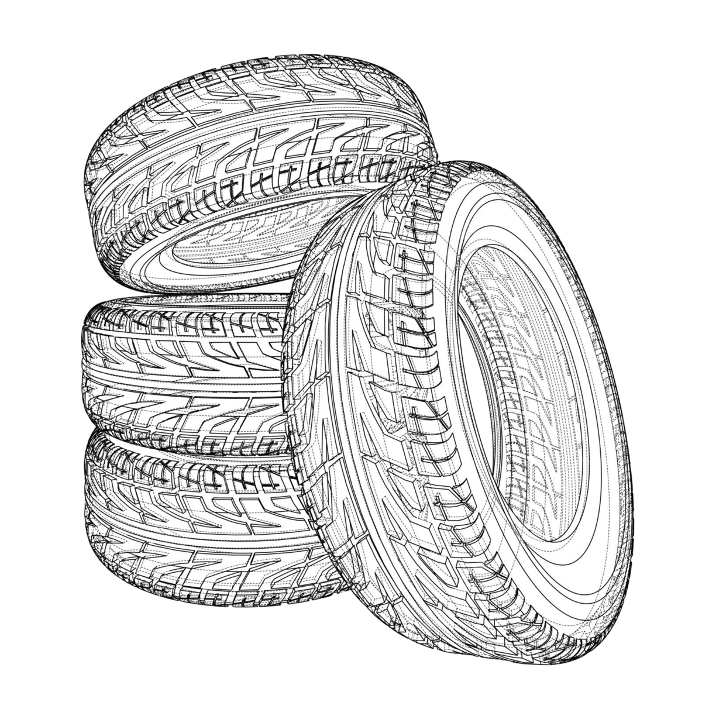

<br/><br/>

```{r setup, include=FALSE}
knitr::opts_chunk$set(echo = TRUE, comment = NA)

c1 ="#FF7F00"  # naranja - color primario 
c2 ="#034A94"  # azul oscuro - color secundario
c3 ="#0EB0C6"  # azul claro - color terciario
c4 ="#686868"  # gris - color texto
```


<br/><br/>

### **1.** 

Los jóvenes colombianos se han vuelto más consientes con respecto a la importancia de una buena nutrición acompañada de actividad deportiva para tener buena salud. Una asociación de médicos opina que quizás los jóvenes estén modificando sus dietas para para incluir menos carnes rojas y más frutas y verduras. 

<center>
```{r, echo=FALSE, out.width="70%", fig.align = "center"}

```
<sub> Tomada de  123rf.com </sub>
</center>

<br/>

Para verificar esta teoría ,un grupo de estudiantes de la Javeriana Cali decide seleccionar registros nutricionales delos estudiantes (consignados en una encuesta realizada por VMU) de hace 10 años y comparar la cantidad promedio de carne de res consumida por año, con las cantidades consumidas por un número de jóvenes que serían entrevistados este año. De acuerdo con  la información actual se estima que el consumo de carne de res por año varia entre 0 y 104  libras por año. 

* ¿Cuántos jóvenes deben seleccionar los investigadores de cada grupo si desean estimar la diferencia en el consumo anual promedio per cápita de carne de res correcta dentro  de 2 libras con un 98% de confianza?

* Si además se desea estimar la proporción de jóvenes que son vegetarianos con un error de muestreo del 5%, ¿que tamaño debe tener la muestra?

<br/><br/><br/>

### **2.**

Los investigadores del problema anterior seleccionaron  dos grupos de 400 jóvenes cada uno y reunieron la siguiente información sobre los hábitos de consumo de carnes de res actuales y de hace 10 años :

|                    |  Hace 10 años  | Este año       |
|:-------------------|:--------------:|:--------------:|
| media muestral     |       73       |  63            |
| desviación estandar muestral |  25  |  28            |


<br/>
<center>
```{r, echo=FALSE, out.width="90%", fig.align = "center"}

```
<sub> Tomada de  123rf.com </sub>
</center>
<br/>

A los investigadores les gustaría poder mostrar que el consumo de carne per cápita se redujo en los últimos 10 años, mediante la construcción de una pruba de hipótesis. ¿A que conclusión se puede lllegar a partir de la información suministrada?


<br/><br/><br/>

### **3.**


<center>
```{r, echo=FALSE, out.width="70%", fig.align = "center"}

```
<sub> Tomada de  123rf.com </sub>
</center>
<br/>

Uno de los problemas más frecuentes en jóvenes universitarios es la alta tensión que generan las evaluaciones finales, las cuales en algunos casos genera dolores de cabeza. La tensión muscular en laregión dela cabeza se ha asociado con los dolores de cabeza, es razonable pensar que si la tensión muscular disminuye, es probable que los dolores de cabeza se reduzcan o desaparezcan. Un grupo de investigadores diseña un experimento en el cual participan nueve estudiantes que padecen dolores de cabeza durante las semanas de evaluación. Posteriormente un grupo de profesionales de ingeniería Biomédica y Enfermería los entrenan con el fin de que puedan aprender a reducir la tensión muscular en la región frontal de la cabeza. Para este experimento el dispositivo mencionado se conecta al musculo frontal, que se encuentra en la región frontal de la cara. El dispositivo indica al estudiante la cantidad de tensión que existe en el musculo al que está unido (en este caso, al frontal) y le ayuda a reducir los niveles de tensión.  Después de 6 semanas de entrenamiento, los jóvenes han logrado mantener una baja tensión en el musculo frontal; entonces se lleva nuevamente un registro de los dolores de cabeza que sufren durante las dos semanas de evaluaciones.  La información recogida se presenta en la siguiente tabla :

<br/>

|Sujeto                  |   1  |   2  |  3   |  4   |  5   |  6   |   7  |   8  |  9   |
|:-----------------------|-----:|-----:|-----:|-----:|-----:|-----:|-----:|-----:|-----:|
|linea base              |  17  |  13  |  6   | 5    |  5   | 10   | 8    | 6    |  7   |
|Después de entrenamiento|   3  |   7  |  2   | 3    |  6   |  2   |  1   |  0   |  2   |

<br/>

Dado que pueden existir problemas de interacción en el planteamiento anterior, debido a que los resultados muestran aparentemente una disminución de los dolores de cabeza, es posible que esta disminución no se deba al entrenamiento realizado con la utilización del dispositivo , sino a algún otro factor también presente en la situación, como por ejemplo el momento en que se realizan las mediciones ( primeros parciales, segundos parciales, finales), los investigadores incorporan un grupo que se denomina grupo control que permita dar cuenta de estas variaciones. Este grupo de jóvenes que  tambien presentan dolores de cabeza fue medido durante los mismos momentos del primer grupo (grupo experimental) salvo que no fue entrenado con el dispositivo para controlar la tension. Durante el periodo intermedion este grupo solo hablo con los investigadores sobre los dolores de cabeza. El número de dolores de cabeza durante la linea base y el segundo periodo para el grupo control se presentan en la siguiente tabla:

<br/>

|Sujeto                  |   1  |   2  |  3   |  4   |  5   |  6   |   7  |   8  |  9   |
|:-----------------------|-----:|-----:|-----:|-----:|-----:|-----:|-----:|-----:|-----:|
|linea base              |   5  |   8  |  14  |  16  |  6   |  5   |   8  |  10  |  9   |
|Después de entrenamiento|   4  |   9  |  12  |  15  |  4   | 3    |  7   | 6    |    7 |

<br/>

Se puede concluir que el tratamiento realizado con el dispivo disminuye los dolores de cabeza? 

<br/><br/>

### **Nota:**

Suponga que el número de dolores de cabeza se distribuye aproximadamente normal. (Basado  en Robert Pangano (2006))


<br/><br/><br/>

### **4.**


Los ingenieros de una ensambladora de automóviles requieren decidir sobre cuál de dos de las marcas de neumáticos deben comprar. La marca FB o la marca KT. Con el fin de tomar una decisión basada en evidencias estadísticas, deciden realizar un experimento en el que usan 12 neumáticos de cada marca. Los neumáticos se utilizan hasta su terminación. Los resultados obtenidos son los siguientes:


```{r, echo=FALSE, out.width="30%", fig.align = "center"}

```

```{r}
library(ggplot2)
FB =c(41.8, 41.6, 31.5, 48.7, 40.8, 31.2, 36.5, 36.2, 32.8, 36.3, 38.6, 30.5)
KT =c(40.5, 38.4, 44.0, 34.9, 44.0, 44.7, 44.0, 47.1, 39.8, 43.9, 44.2, 40.2)

llantas = data.frame(rendimiento =c(FB, KT),
                     marca = rep(c("FB","KT"), each=12 ))

# Crear el boxplot con ggplot2
ggplot(llantas, aes(x = marca, y = rendimiento, fill = marca)) +
  geom_boxplot() +
  geom_point(position = position_jitterdodge(jitter.width = 0.2), size = 3) +
  labs(x = "Marca", y = "rendimiento") +
  scale_fill_manual(values = c("FB" = "lightblue", "KT" = "lightgreen")) +
  theme_minimal()


```


Cuál marca de neumáticos recomendaría comprar. Justifique su respuesta. Suponga que la distancia recorrida por un neumático se distribuye aproximadamente normal y un $\alpha$ = 0,05.

```{r}
t.test(llantas$rendimiento  ~ llantas$marca)
```


<br/><br/><br/>

### **5.**

Un director de un gimnasio quiere determinar si un instructor de ejercicio debe ser contratado o no para su campaña estrella “Reducción de peso”, Para tomar la decisión le dice que pruebe con 16 de las personas que habitualmente concurren tomadas al azar. Los datos que se tomaron antes ($x_{1}$) y después ($x_{2}$) de haber realizado un mes de ejercicios son los siguientes:
	
|id     | 1  | 2  |  3 | 4  | 5  | 6  | 7  | 8  | 9  | 10 | 11 | 12 | 13 | 14 | 15 | 16 |
|------:|---:|---:|---:|---:|---:|---:|---:|---:|---:|---:|---:|---:|---:|---:|---:|---:|                 
|$x_{1}$|104 | 89 | 84 | 106| 90 | 96 | 79 | 90 | 85 | 76 | 91 | 82 | 100| 89 | 121| 72 | 
|$x_{2}$| 98 | 85 | 85 | 103| 88 | 95 | 79 | 90 | 82 | 76 | 89 | 81 |  99| 86 | 111| 70 | 


Emplee y realice las pruebas de hipótesis a un nivel de significancia del 0.01 para determinar si el programa que ofrece el nuevo instructor es eficaz. Suponga que la variable peso se distribuye aproximadamente normal.

