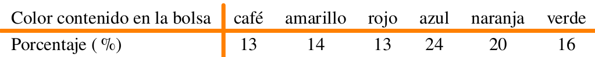
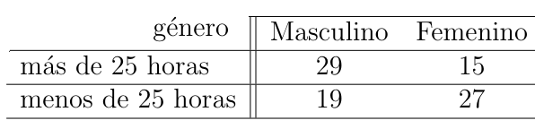

```{r setup, include=FALSE}
knitr::opts_chunk$set(echo = TRUE, message = FALSE, warning = FALSE, comment = NA)
library(psych)
library(summarytools)

# install.packages("devtools")
#devtools::install_github("dgonxalex80/paquete014")
#library(paquete014)
library(TeachingSampling)
data("BigLucy")
# colores
c0= "#F7AA00"
c1= "#235784"
c2= "#40A8C4"
c3= "#EEF6F7"

c4= "#11224D"
c5= "#5B84C4"


```

<br/><br/><br/>

<br/><br/><br/>

## **Problema 1**	


La compañía de dulces Mars publica en su sitio web información relacionada con los porcentajes de los distintos colores de sus dulces M\|M para la variedad de chocolate con leche.

<br/><br/>

```{r, echo=FALSE, out.width="60%", fig.align = "center"}

```

<br/><br/>

<!-- |Color contenido en la bolsa | café       | amarillo  | rojo    | azul     | naranja  | verde     | -->
<!-- |:---------------------------|:----------:|:---------:|:-------:|:--------:|:---------|:---------:| -->
<!-- |Porcentaje (\%)             | 13         | 14        | 13      | 24       | 20       | 16        | -->

	
Se realiza una verificación mediante el conteo delos dulces contenidos e n una bolsa de 14 onzas de dulces M\|M, obteniendo los siguientes resultados: 70 duces cafés, 72 amarillos, 61 rojos, 118 azules, 108 naranjas y 85 verdes. 
	
Se podria afirmar que los datos anteriores respaldan la información suministrada por la compañía en su sitio web? Sustente su respuesta.
	

<br/><br/><br/>

## **Problema 2**	

En una línea de producción los artículos se inspeccionan en forma periódica con el fin de detectar defectos. La siguiente secuencia de artículos defectuosos (D) y no defectuosos (N) corresponde a la producción de uno de los turnos. 
```{r}
inspeccion = sample(c("D", "N"), 50, replace = TRUE)
inspeccion
```


Se puede afirmar que los datos no presentan patrón alguno y que la generación de artículos defectuosos se debe al azar? . Utilice un  $\alpha= 0.05$.

<br/><br/><br/>

## **Problema 3**
	
En una planta ensambladora de camiones la supervisión diaria de las soldaduras generó la siguiente información :

<br/><br/>

```{r, echo=FALSE, out.width="35%", fig.align = "center"}
knitr::include_graphics("img/tabla_p12.png")
```

<br/><br/>

```{r}
x=c(470,445,257,191,171,139,42,28,17)
m=matrix(x, ncol = 3)
colnames(m) = c("alta", "moderada", "baja")
rownames(m) = c("dia", "tarde", "noche")
m
```


¿Se puede concluir que la calidad varia con los turnos?, en otras palabras se puede concluir que la calidad de las soldaduras es independiente de los turnos? . Utilice un nivel de significancia $\alpha=0.05$.
	
<br/><br/><br/>

## **Problema 4**

Los siguientes datos corresponde a las notas obtenidas por un grupo de estudiantes de la asignatura Matemáticas Fundamentales. Si la distribución de los datos es normal, podría afirmar que la prueba realizada es una prueba normalizada. En caso contrario serviría para estudiar problemas relacionados con su aprendizaje. Para un $\alpha= 0;05$, se podría afirmar que los datos proceden de una distribución normal? . Si se requiere realizar una prueba de hipótesis sobre la media de la nota $H_{o}:\mu \leq 3.3$ vs $H_{a}: \mu > 3.3$, ¿Que prueba se realizaría? 


```{r}
x=c(3.4, 2.8, 4.2, 2.1, 2.8, 2.4, 3.5, 4.2, 3.1, 4.1, 2.4, 3.4, 4.1, 4.0, 2.4, 4.1, 3.4, 4.4, 3.8, 3.7, 2.2, 3.6, 2.3, 3.7, 2.8, 4.1, 2.3, 4.6, 4.6, 5.2, 2.4, 2.4, 2.7, 3.8, 4.6, 4.4, 4.2, 4.4, 2.4, 3.3, 3.8, 2.9, 3.1, 2.7, 3.6, 3.8, 4.4, 3.9, 2.8, 3.7)
x

	
```
	
<br/><br/><br/>

## **Problema 5**

Una muestra aleatoria de 90 adultos se cla- sifica de acuerdo al genero y el n ́ umero de horas que dedica a ver el celular durante una semana:


```{r, echo=FALSE, out.width="35%", fig.align = "center"}

```

Utilice un nivel de significancia del 0 . 05 y pruebe la hip ́ otesis de que el tiempo dedica- do a ver televisi ́ on es independiente de si el espectador es hombre o mujer.

<br/><br/><br/>

## **Problema 6**

Realiza un mapa mental sobre las pruebas de hipótesis relacionadas con la distribución normal. Que incluya:
nombre de la prueba, su estadístico de prueba, la distribución que sigue el estadístico de prueba y en que casos se utiliza.


<br/><br/><br/>
